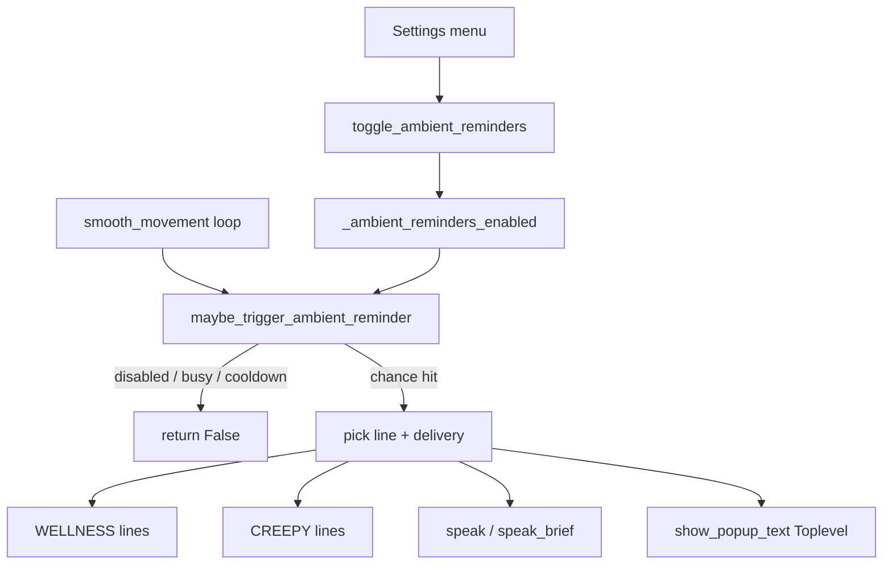

# Ambient Reminder Nudges

## Entscheidung (aus deinen Antworten)

- **Trigger:** spontan im Roaming-Loop (wie Ads/Glitch), nicht über „Set Reminder“
- **Darstellung:** zufällig Bubble **oder** Text-Popup
- **Frequenz:** Chance höher als Ads (`AD_POPUP_CHANCE = 1/750`) → **`1/400`**
- **Cooldown:** mindestens **5 Minuten** zwischen zwei Nudges
- Bestehender Timer „Set Reminder“ bleibt unverändert

## Architektur

## Schritt 1 — Content

Neue Datei [`content/nudge_lines.py`](content/nudge_lines.py) (Analog zu [`content/ads_lines.py`](content/ads_lines.py) / [`content/hug_lines.py`](content/hug_lines.py)):

- `WELLNESS_NUDGE_LINES` — z.B. hydrate, stretch, rest, blink, snack break
- `CREEPY_NUDGE_LINES` — z.B. „I am watching“, „Don’t leave“, „I never sleep“
- Hilfsfunktion `pick_nudge_line()` die zuerst Kategorie (50/50) wählt, dann `pick_line`

Toggle-Feedback in [`content/dialogue.py`](content/dialogue.py):

- `BUTTON_REMINDERS` / `BUTTON_REMINDERS_ON` / `BUTTON_REMINDERS_OFF`
- `REMINDERS_ON_LINES` / `REMINDERS_OFF_LINES`

## Schritt 2 — Feature-Mixin

Neue Datei [`kinito/features/nudges.py`](kinito/features/nudges.py) mit `NudgesMixin`:

| Konstante / State | Wert |
|---|---|
| `NUDGE_CHANCE` | `1 / 300` |
| `NUDGE_COOLDOWN_SECONDS` | `300` |
| `NUDGE_POPUP_CHANCE` | `0.5` (sonst Bubble) |
| `_ambient_reminders_enabled` | default `True` (Init in App) |
| `_last_nudge_at` | `0.0` monotonic |

`maybe_trigger_ambient_reminder() -> bool`:

1. Guards wie Ads ([`kinito/features/ads.py`](kinito/features/ads.py)): Feature-Flag, Focus, Game, Pause, Drag, Camera, Browser
2. Zusätzlich: `_is_busy_with_speech()` und Cooldown (`time.monotonic() - _last_nudge_at < 300`)
3. Chance-Roll; bei Hit `root.after(0, self._present_ambient_nudge)` und Timestamp setzen

`_present_ambient_nudge()`:

- Zeile aus `pick_nudge_line()`
- Mit `NUDGE_POPUP_CHANCE`: Text-Popup **oder** `speak(text)` (Bubble + TTS)
- Popup: neues `show_popup_text(text, title="KinitoPET")` — kompaktes topmost-`Toplevel` mit Label (kein Image nötig; getrennt von `show_popup_image`)

`toggle_ambient_reminders()`: Flag flippen + ON/OFF-Line sprechen (wie `toggle_screen_effects` in [`kinito/features/glitch.py`](kinito/features/glitch.py)).

## Schritt 3 — Wiring

1. [`kinito/app.py`](kinito/app.py): `NudgesMixin` in die Mixin-Liste; `self._ambient_reminders_enabled = True`, `self._last_nudge_at = 0.0`
2. [`kinito/movement.py`](kinito/movement.py):
   - Stub `maybe_trigger_ambient_reminder() -> False` neben den Ads/Glitch-Stubs
   - In `smooth_movement` direkt nach `maybe_trigger_random_ad()` aufrufen
3. [`content/dialog_registry.py`](content/dialog_registry.py):
   - Button in `settings_options_for(app)` — state-aware Label (`ON`/`OFF` je nach Flag)
   - Mapping in `_menu_action_handlers()` → `toggle_ambient_reminders`
4. Coverage-Tests anpassen (`tests/test_questions_coverage.py` Settings-Liste)

## Schritt 4 — Tests

Neue Datei `tests/test_nudges.py` (Vorbild [`tests/test_glitch.py`](tests/test_glitch.py)):

- Disabled / Focus / Cooldown / Chance-Miss → `False`
- Chance-Hit → schedult Present + setzt `_last_nudge_at`
- Toggle flipped Flag und spricht passende Lines
- Optional: Delivery-Pfad (Bubble vs Popup) mit gemocktem `random`

Content-Pool in `tests/test_content_data.py` als nicht-leere Listen prüfen.

## Nicht im Scope

- Persistenz über Neustart (wie Screen Effects: session-only)
- Änderung am bestehenden Minuten-Timer „Set Reminder“
- Separate Settings für nur-Wellness / nur-Creepy / nur-Bubble
