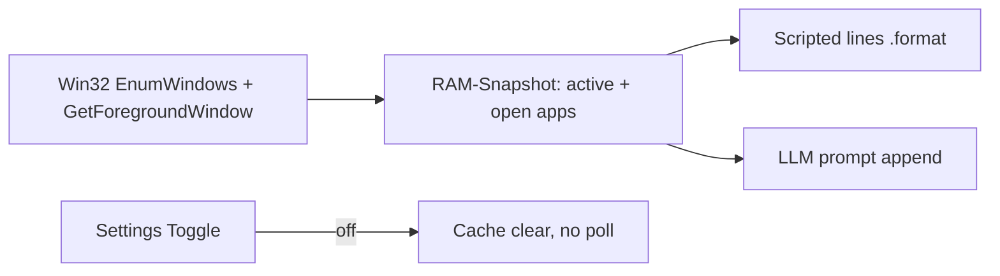

# App-Awareness (offene + aktive Apps)

## Machbarkeit und Privacy

**Ja, machbar** auf Windows (dieses Projekt nutzt bereits Win32/`ctypes` in [`kinito/app.py`](kinito/app.py)).

**Ollama speichert eure Prompts nicht dauerhaft:** Anfragen gehen lokal an `127.0.0.1:11434`; Chat-Historie in der App ist nur RAM ([`kinito/llm/conversation.py`](kinito/llm/conversation.py)). Kein Cloud-Upload. App-Kontext wird **nicht** in `memory.json` geschrieben.

**Rest-Risiko (akzeptabel mit Toggle):** Während die Erkennung an ist, sieht Kinito lokal, welche Fenster-Apps offen/aktiv sind. Keine Fenstertitel, keine Dokument-/Tab-Inhalte. Beim Abschalten: Cache leeren, kein weiteres Polling.

## Gewählter Scope

- **Alle sichtbaren Fenster-Apps** (deduplizierte App-Namen) **+ aktives Fenster**
- Nur **Prozess-/App-Name** (z.B. `chrome.exe` → `Chrome`), **keine** `GetWindowText`-Titel
- Eigenen Prozess, unsichtbare Fenster und typische Shell-Rauschen filtern
- Nicht-Windows: Feature no-op / Toggle ohne Wirkung

## Umsetzung

### 1. Snapshot-Modul

Neu: [`kinito/app_context.py`](kinito/app_context.py)

- `AppSnapshot(active: str | None, open_apps: tuple[str, ...])`
- Win32: `EnumWindows` → sichtbare Top-Level-HWNDs → `GetWindowThreadProcessId` → Image-Name via `QueryFullProcessImageNameW` / Fallback
- Friendly-Name-Map für häufige Exe-Namen; sonst Stem des Exe-Namens
- Kurzer Cache (z.B. 2–3 s), damit Idle-Loop/LLM nicht spammen

### 2. Feature-Mixin + Settings-Toggle

Neu: [`kinito/features/app_awareness.py`](kinito/features/app_awareness.py) analog zu Reminders/Screen Effects

- Flag `_app_awareness_enabled = True` in [`kinito/app.py`](kinito/app.py) (session-only, wie bestehende Toggles)
- `toggle_app_awareness()`, `get_app_snapshot()` (nur wenn enabled)
- Mixin in `FloatingAssistant` einhängen

Settings-Menü ([`content/dialog_registry.py`](content/dialog_registry.py) + Labels/Lines in [`content/dialogue.py`](content/dialogue.py)):

- Buttons `App Awareness on/off` (dynamisches Label wie Reminders)
- ON/OFF-Bestätigungslines im Kinito-Ton

### 3. Einbindung in Lines + KI

**Scripted**

- Helper `format_app_aware_line(template, snapshot)` mit `{active_app}` / `{open_apps}`
- Neue Line-Pools (Idle/Nudges/Reaktionen), die nur gewählt werden, wenn Snapshot vorhanden ist
- Integration in [`kinito/features/nudges.py`](kinito/features/nudges.py) und passende Content-/Idle-Pfade

**LLM** (Spiegel zu Time-Context)

- In [`content/llm_prompts.py`](content/llm_prompts.py): `app_context_block(snapshot)` + `append_app_context(...)`
- Aufruf aus [`kinito/features/llm.py`](kinito/features/llm.py) `_build_generation_prompt` und Chat-Systemprompt (transient)
- Prompt-Hinweis: nur App-Namen erwähnen, keine Fensterinhalte erfinden; Kontext ist live und nicht speichern
- **Nicht** an `MemoryExtractor` / `memory.json` anbinden

### 4. Tests

- Unit-Tests für Friendly-Namen, Filter, Format-Helper (gemocktes Snapshot)
- Dialog-Handler-Test für Toggle + Settings-Label
- LLM-Prompt-Test: Context nur wenn enabled und Snapshot da; kein Leak in Memory-Pfade

## Bewusst nicht im Scope

- Fenstertitel / Tab-Inhalte / Screenshots
- Persistenz des Toggles oder der App-Liste
- Prozessliste ohne Fenster
- macOS/Linux-Implementierung (nur sicherer No-op)
