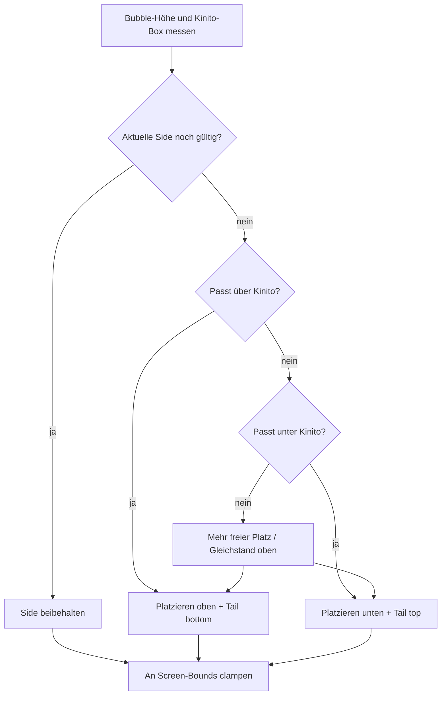

# Dynamische Bubble-Platzierung (oben/unten)

## Ausgangslage (belegt im Code)

[`position_speech_bubble`](kinito/speech.py) setzt die Bubble immer über Kinito (`kinito_y - bubble_h - 12`) und clampt nur an den Screen-Rand – kein Flip. Der Tail in [`draw_bubble_shell`](kinito/bubble_ui.py) ist fest unten verdrahtet. [`_move_speech_bubble_with_kinito`](kinito/speech.py) hält ein **starres Offset** (`_bubble_kinito_offset_*`), sodass ein Flip während Drag/Throw aktuell unmöglich ist.

Chat und Poems nutzen dieselbe Bubble-Pipeline (`show_speech_bubble` / Fit + Schedule); eine Höhen-basierte Entscheidung in `position_speech_bubble` gilt automatisch für beide.

Bereits vorhanden: [`_window_screen_size`](kinito/app.py) liefert Breite **und** Höhe (Sprite + Window). Periodischer Re-Anchor läuft über `_update_speech_bubble_position` (~100 ms).

## Gewähltes Verhalten

1. **Oben**, wenn die Bubble vollständig über Kinito passt:
   `above_y = kinito_y - bubble_h - gap` und `above_y >= min_y`.
2. Sonst **unten**, wenn sie vollständig unter Kinito passt:
   `below_y = kinito_y + kinito_h + gap` und `below_y <= max_y`
   (`max_y` aus `get_screen_bounds(bubble_w, bubble_h)` = oberste zulässige Bubble-Y).
3. Passt beides nicht (sehr hohe Chat-/Poem-Bubble): Seite mit **mehr freiem Platz** wählen, dann clampen (darf Kinito teilweise überlappen).

   **Platzformel (explizit):**
   - `space_above = max(0, kinito_y - min_y)`
   - `space_below = max(0, (max_y + bubble_h) - (kinito_y + kinito_h))`
     (nutzbare Pixel unter Kinito bis Unterkante Screen; `max_y + bubble_h` ≈ Screen-Unterkante für dieses Bubble-Maß)
   - Bei Gleichstand: **`"above"`** (Default wie bisher).

4. **Hysterese (Pflicht):** Gespeicherte Seite `_speech_bubble_side` beibehalten, solange sie noch „knapp“ passt. Wechsel nur wenn:
   - die andere Seite **vollständig** passt **und**
   - die aktuelle Seite **nicht** mehr passt, **oder**
   - die aktuelle Seite nicht passt und die andere mehr Platz hat (Fallback-Fall).
   - Zusätzlich optionaler Puffer `gap + hysteresis_px` (z. B. 8–16 px) beim Verlassen der bevorzugten Seite, damit Drag am Rand nicht flackert.

5. Bei Bewegung/Drag/Timer erneut berechnen – mit Hysterese zurück nach oben, sobald oben wieder klar Platz ist.

6. Tail zeigt immer zu Kinito: `"bottom"` bei Bubble-oben, `"top"` bei Bubble-unten.

## Nicht-Ziele / bewusste Grenzen

- Kein Link/Rechts-Flip der Bubble (nur vertikal).
- Kein Click-Through bei Überlappung im Fallback-Fall (bestehendes topmost-Verhalten bleibt).
- Keine Änderung der horizontalen Zentrierung über Kinito.

## Änderungen

### 1. Placement-Logik in [`kinito/speech.py`](kinito/speech.py)

- `_kinito_screen_height()` analog zu `_kinito_screen_width` **oder** intern `_window_screen_size()` nutzen (keine divergierende Höhenlogik).
- Konstanten: `_speech_bubble_gap = 12`, optional `_speech_bubble_side_hysteresis_px`.
- **Pure** Hilfsfunktion (ohne Tk), unit-testbar:

  `_choose_speech_bubble_side(*, kinito_y, kinito_h, bubble_h, min_y, max_y, current_side=None, gap=12, hysteresis_px=…) -> "above"|"below"`

- `position_speech_bubble`: Side wählen → `bubble_y` setzen → `_speech_bubble_side` speichern → clampen → bei Side-Wechsel Shell neu zeichnen (`_update_bubble_tail` / `_redraw_bubble_shell`).
- `_redraw_bubble_shell`: Body-Window-Y und Canvas-Layout abhängig von Side:
  - Tail unten (heute): Body bei `inset + outline_pad`, Tail darunter; Canvas-Höhe wie bisher.
  - Tail oben: Body um `tail_height` nach unten versetzt; Tail-Polygon oberhalb des Bodies; Outline-Pad auch oben berücksichtigen (heute asymmetrisch nur unten).
- `draw_bubble_shell(..., tail_side="bottom"|"top")` aufrufen.
- State bei Close zurücksetzen: `_speech_bubble_side = None` in `_close_speech_bubble_impl`.

### 2. Drag/Throw: dynamisch statt starrem Y-Offset

In [`_move_speech_bubble_with_kinito`](kinito/speech.py) (via [`_follow_speech_bubble_to_kinito`](kinito/movement.py)):

- **Y immer** über dieselbe Side-/Y-Logik wie `position_speech_bubble` (nicht Offset-Y).
- `_capture_speech_bubble_drag_offset`: Offset-Y nicht mehr als Quelle der Wahrheit; Capture darf No-Op werden oder nur noch X behalten, falls X weiter offset-basiert bleibt. Bevorzugt: **beide Achsen über Placement**, damit ein Codepfad bleibt.
- **Performance:** `position_speech_bubble` macht `update_idletasks` auf Root + Bubble. Beim hochfrequenten Drag/Throw einen schlanken Pfad nutzen (bereits gemessene `bubble_w/h`, kein doppeltes Idle-Update), der nur Side+Geometry+Tail aktualisiert – inhaltlich identisch zur Placement-Formel.

### 3. Tail-Richtung in [`kinito/bubble_ui.py`](kinito/bubble_ui.py)

- Parameter `tail_side: "bottom" | "top"` (Default `"bottom"`).
- Bei `"top"`: Body-Rechteck nach unten versetzt; Tail-Dreieck zeigt nach oben (Spitze bei kleinerem Y).
- Border/Chamfer-Verhalten analog zur Bottom-Variante spiegeln (Tail-Anschluss an Body-Kante).

### 4. Tests

- [`tests/test_speech_helpers.py`](tests/test_speech_helpers.py):
  - Bestehende Asserts (`…+208` = `300 - 80 - 12`) behalten, wo oben Platz ist; Fixtures um `kinito_h` / Bounds ergänzen.
  - Neue Fälle: Flip nach unten (Kinito nah an `min_y`), Zurück-Flip nach oben, **Hysterese** (kein Flip bei 1 px Grenzwackeln).
  - Drag-Pfad: `_move_speech_bubble_with_kinito` ändert Y-Side bei fehlendem Platz oben (nicht mehr starres Offset).
- Pure Tests für `_choose_speech_bubble_side` (ohne Tk-Mocks), inkl. Gleichstand → `"above"`.
- [`tests/test_bubble_ui.py`](tests/test_bubble_ui.py): Tail-Polygon-Koordinaten bei `tail_side="top"` (Spitze oberhalb Body).

## Abnahmekriterien

- [ ] Bubble über Kinito, wenn oben voller Platz; unter Kinito, wenn oben nicht und unten ja.
- [ ] Sehr hohe Bubble: Seite mit mehr Platz, dann Clamp; App stürzt nicht ab.
- [ ] Drag von unten nach oben am Screen: Flip ohne sichtbares Flackern (Hysterese).
- [ ] Tail zeigt stets zu Kinito (oben bzw. unten).
- [ ] Bestehende Happy-Path-Tests (mitten auf dem Screen) unverändert grün.

## Devil's-Advocate-Nachzug (kurz)

| Risiko | Score (I×P) | Gegenmaßnahme | Aufwand |
|--------|-------------|---------------|---------|
| Flackern am Schwellwert beim Drag | 4×4=16 | Hysterese / sticky side | S |
| `update_idletasks` pro Drag-Frame | 3×3=9 | Leichter Follow-Pfad | S |
| Unklare „mehr Platz“-Formel | 3×4=12 | Formel oben festschreiben + Unit-Test | S |
| Canvas-Pad/Body-Y bei Tail oben falsch | 4×3=12 | Explizites Layout + Polygon-Assert | M |
| Divergenz `_kinito_screen_height` vs `_window_screen_size` | 2×3=6 | Eine Höhenquelle | S |
