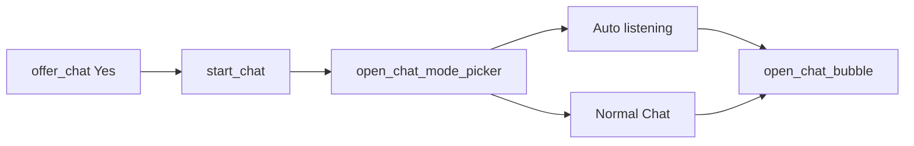

# Chat-Einladung von Kinito

## Ziel

Kinito bekommt im Idle-Verhalten die Chance, zu fragen „Willst du chatten?“. Bestätigt der User mit **Yes**, landet er genau dort, wo man zwischen **Auto listening** und **Normal Chat** wählt (`open_chat_mode_picker`).

## Bestehender Flow (unverändert nutzen)



[`start_chat()`](kinito/features/llm.py) prüft bereits Ollama und ruft danach `open_chat_mode_picker()` auf — der Yes-Handler braucht nur `start_chat()` aufzurufen.

## Umsetzung (wie Browser/Kamera)

### 1. Texte in [`content/dialogue.py`](content/dialogue.py)

Neben den bestehenden `CHAT_*`-Strings (~802):

- `CHAT_INVITE_MARKER` — Substring, der in jeder Frage vorkommt (z.B. `"want to chat"`), damit `find_dialog_spec` greift
- `CHAT_INVITE_QUESTIONS` — mehrere Varianten im Kinito-Ton (wie `BROWSER_QUESTIONS`)
- `CHAT_INVITE_DECLINED_LINES` — Ablehnungs-Acks (wie `BROWSER_DECLINED_LINES`)

### 2. Yes/No in [`content/dialog_registry.py`](content/dialog_registry.py)

Neuer `DialogSpec` neben Browser/Kamera (~1462):

```python
DialogSpec(
    dlg.CHAT_INVITE_MARKER,
    DialogUI("buttons", buttons=(dlg.BUTTON_YES, dlg.BUTTON_NO)),
    _yes_no(lambda a: a.start_chat(), dlg.CHAT_INVITE_DECLINED_LINES),
),
```

### 3. Trigger-Methode in [`kinito/features/llm.py`](kinito/features/llm.py)

`offer_chat()` analog zu `offer_browser_visit()`:

- Abbruch wenn busy / schon `_chat_mode`
- Optional früh abbrechen wenn LLM aus/Ollama down (sonst kommt `CHAT_UNAVAILABLE` erst nach Yes — früh filtern ist freundlicher)
- `speak(pick_line(CHAT_INVITE_QUESTIONS), 45, True, skip_ai=True)` — `skip_ai=True`, damit der Marker nicht von der AI umgeschrieben wird

### 4. Idle-Chance in [`kinito/features/content.py`](kinito/features/content.py)

In `perform_random_menu_action()` Action ergänzen:

```python
("chat_invite", self.offer_chat),
```

Zusätzlich in der Fragen-Pool-Filterung (wie bei Kamera): Chat-Invite-Fragen aus dem Pool nehmen, wenn bereits Chat aktiv oder LLM nicht erreichbar.

### 5. Fragen-Pool in [`content/questions.py`](content/questions.py)

`CHAT_INVITE_QUESTIONS` importieren und in `QUESTIONS` aufnehmen — zweite Chance über `speak_random_question()`, konsistent mit Browser/Kamera.

### 6. Mood-Gewichte in [`kinito/features/mood.py`](kinito/features/mood.py)

- Basis: `"chat_invite": 1.0`
- Stärker bei **bored** / **sad** (Gesellschaft suchen)
- Schwächer bei **tired** / **annoyed** / **angry**

## Was nicht geändert wird

- [`open_chat_mode_picker()`](kinito/speech_chat.py) und die Voice-/Normal-UI bleiben wie sie sind
- Menü-Button „Chat“ bleibt unverändert (`BUTTON_CHAT` → `start_chat()`)
- Kein neuer Chat-Einstieg am Mode-Picker vorbei
