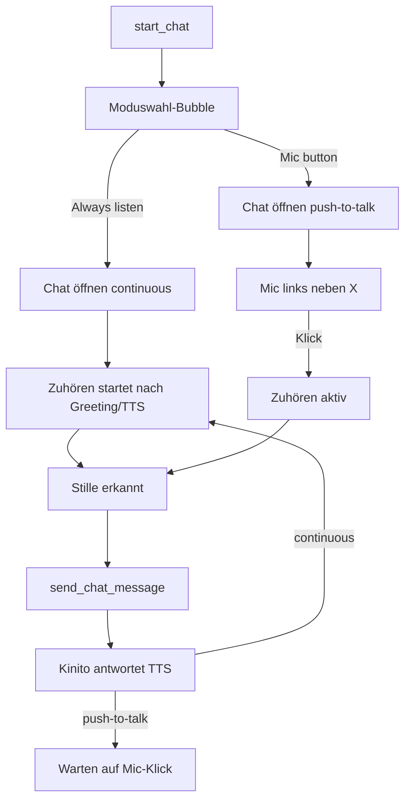

# Chat-Spracheingabe (Moduswahl + lokales STT)

## UX-Ablauf

1. **Moduswahl beim Öffnen:** `start_chat` öffnet nicht direkt die volle Chat-UI, sondern eine kurze Bubble mit Prompt + zwei Buttons (Texte in [`content/dialogue.py`](content/dialogue.py)), z.B. „Auto listening“ / „Normal Chat“, plus × zum Abbrechen.
2. Nach Auswahl: bestehende Chat-Bubble wie heute ([`open_chat_bubble`](kinito/speech_chat.py)), Input-Zeile: **Entry | Emoji | Mic | ×**.
3. **Push-to-Talk:** Mic startet/stoppt Zuhören; nach kurzer Stille (ca. 1–1,5 s nach erkanntem Sprechen) wird der Text **automatisch gesendet** — erneutes Drücken zum Senden ist nicht nötig.
4. **Dauer-Mikrofon:** Zuhören startet automatisch, sobald Greeting/TTS fertig ist; nach Stille senden; nach Kinitos Antwort wieder zuhören. Mic-Button pausiert/setzt fort.
5. **Echo-Schutz (beide Modi):** während `talking` / `_chat_generating` kein Capture/keine Transkription; Resume erst nach TTS-Ende (`speak_chat_response`-Finish).

## Technische Umsetzung

### STT-Backend (lokal)
- Neues Modul z.B. [`kinito/stt/voice_input.py`](kinito/stt/voice_input.py): Capture (`sounddevice` + `numpy`), Stille per RMS-Energie + Timeout, Transkription mit **`faster-whisper`** (Modell `tiny` oder `base`, englisch wie der Chat-Dialog).
- Lazy-Import wie bei Camera ([`kinito/features/camera.py`](kinito/features/camera.py)): fehlen Pakete → freundliche Fehlermeldung, Chat bleibt textfähig.
- Worker-Thread; UI-Callbacks nur über `root.after(0, …)`.
- Abhängigkeiten in [`requirements.txt`](requirements.txt): `faster-whisper`, `sounddevice`, `numpy` (falls nicht schon transitív).

### Chat-UI / State
- [`kinito/speech_chat.py`](kinito/speech_chat.py): Moduswahl-UI; Mic-Button links vom ×; State `_chat_voice_mode` (`"continuous"` | `"push"` | `None`); Listening-Toggle inkl. visuellem Aktiv-Zustand (z.B. anderer Button-Hintergrund).
- Live-Partial optional: finales Transkript in Entry setzen und bei Finalize `send_chat_message` aufrufen (gleiche Pfad wie Enter).
- [`close_chat_mode`](kinito/speech_chat.py): STT-Session hart stoppen und aufräumen.
- [`kinito/features/llm.py`](kinito/features/llm.py): `start_chat` → Moduswahl; nach Wahl `open_chat_bubble`; in `_on_chat_response` / TTS-Finish Continuous neu starten.

### Texte
- Neue Konstanten in [`content/dialogue.py`](content/dialogue.py) (Prompt, Button-Labels, STT-Fehler/keine-Mic-Zeilen). Keine Hardcoded-UI-Strings in Features.

### Tests
- Unit-Tests ohne echtes Mikrofon: Moduswahl setzt State; Silence-Finalize ruft `send_chat_message` auf; Listening pausiert bei `talking`/`_chat_generating`; `close_chat_mode` stoppt Session.
- Bestehende [`tests/test_speech_chat.py`](tests/test_speech_chat.py) erweitern bzw. neues `tests/test_voice_input.py`.

## Bewusste Defaults
- Modus jedes Mal neu wählen (kein Persistieren in Settings).
- Sprache der Erkennung: Englisch (passt zu Chat/TTS-Dialog).
- Kein Always-on außerhalb des Chats.
