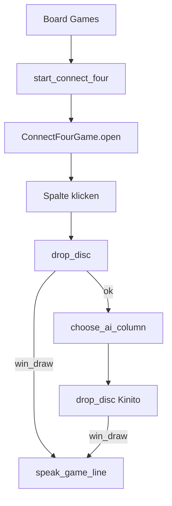

# Connect Four unter Board Games umsetzen

## Festlegungen

- **Brett:** klassisch **6 Reihen × 7 Spalten** (feste Größe)
- **Modus:** Spieler vs. Kinito (wie Tic-Tac-Toe) — Spieler beginnt, wirft per Spaltenklick; Steine fallen nach unten
- **Farben/Zeichen:** Spieler = lila/`L`, Kinito = rosa/`R` (Text auf Buttons reicht, kein Canvas nötig)
- **KI:** wie Tic-Tac-Toe — zuerst eigenen Gewinnzug, dann Block, sonst Heuristik (Mitte bevorzugen), sonst Zufall

Pfad: Rechtsklick → **Actions** → **Play Game** → **Board Games** → **Connect Four**



## Schritt 1 — Dialog-Texte

In [`content/dialogue.py`](content/dialogue.py):

- `BUTTON_GAME_CONNECT_FOUR = "Connect Four"`

In [`content/game_lines.py`](content/game_lines.py):

- `CONNECT_FOUR_PLAYER_WIN_LINES`
- `CONNECT_FOUR_KINITO_WIN_LINES`
- `CONNECT_FOUR_DRAW_LINES`

Kein eigener DialogSpec-Marker (nur Button im Board-Games-Submenü).

## Schritt 2 — Logik (`connect_four.py`)

Neue Datei [`kinito/features/games/connect_four.py`](kinito/features/games/connect_four.py) — **ohne tkinter**, testbar:

| API | Aufgabe |
|-----|---------|
| `ROWS, COLS = 6, 7` | feste Brettgröße |
| `PLAYER, KINITO, EMPTY` | Zellwerte |
| `new_board()` | 6×7 mit `EMPTY` |
| `valid_columns(board)` | Spalten mit freiem Top-Slot |
| `drop_disc(board, col, player)` | Stein in unterste freie Zelle; Rückgabe `(row, col)` oder `None` wenn Spalte voll |
| `check_winner(board)` | 4 in Reihe (horizontal/vertikal/diagonal) → `PLAYER`/`KINITO`; voll ohne Gewinner → `"draw"`; sonst `None` |
| `winning_column(board, player)` | Spalte, mit der `player` sofort gewinnt |
| `choose_ai_column(board)` | Win → Block → Mitte (Spalte 3) → nahe Mitte → Zufall aus `valid_columns` |

Brett als `list[list[str]]` mit `board[row][col]`, Zeile 0 = oben (Anzeige), Fall-Logik sucht von unten (`ROWS-1` → `0`).

## Schritt 3 — UI (gleiche Datei oder `connect_four_ui.py`)

Analog zu [`tic_tac_toe.py`](kinito/features/games/tic_tac_toe.py): Logik + UI in **einer Datei** `connect_four.py` (weniger Dateien als Battleships, passt zum TTT-Vorbild).

Klasse `ConnectFourGame`:

1. `open()` → `open_game_window(app, "Connect Four with Kinito", …)` + `create_uniform_grid(…, ROWS, COLS, …)`
2. Status-Label: „Your turn“ / „Kinito's turn“ / Ergebnis
3. Zellen als kreisrunde Buttons; Klick auf Zelle = Zug in **dieser Spalte** (`event`/`col` aus Button-Index)
4. Nach Spielerzug: bei Ende `speak_game_line`; sonst `root.after(short, kinito_move)` damit die UI kurz updatet
5. Volle Spalte: Klick ignorieren
6. **New Game**-Button → Brett leeren, Buttons reset
7. Nach Spielende Buttons deaktivieren bis New Game

Darstellung: leere Zelle `"·"` oder leer; Spieler/Kinito mit farbigem Text (`fg`) oder Emoji-Kreis — schlicht halten, wie Memory/TTT.

## Schritt 4 — Launcher

In [`kinito/features/games/__init__.py`](kinito/features/games/__init__.py):

```python
def start_connect_four(self):
    """Open a Connect Four game window."""
    self.root.after(0, lambda: ConnectFourGame(self).open())
```

## Schritt 5 — Menü verdrahten

In [`content/dialog_registry.py`](content/dialog_registry.py):

- `BOARD_GAMES_MARKER`-Buttons um `BUTTON_GAME_CONNECT_FOUR` ergänzen
- `_handle_board_games`: `dlg.BUTTON_GAME_CONNECT_FOUR: lambda a: a.start_connect_four()`

## Schritt 6 — Tests

[`tests/test_games.py`](tests/test_games.py):

- `drop_disc` stapelt von unten; volle Spalte → `None`
- horizontaler / vertikaler / diagonaler Gewinn erkannt
- Unentschieden bei vollem Brett ohne 4er
- `choose_ai_column` nimmt Gewinnzug, sonst Blockzug

[`tests/test_dialog_handlers.py`](tests/test_dialog_handlers.py):

- Board Games → `BUTTON_GAME_CONNECT_FOUR` ruft `start_connect_four` auf

README Mini-games-Zeile um Connect Four ergänzen (wie bei Snake).

## Reihenfolge

1. Logik + Unit-Tests  
2. UI in derselben Datei  
3. Dialog / `game_lines` / Mixin / Registry  
4. Handler-Tests  

## Abgrenzung

- Keine Schwierigkeitsstufen, kein Minimax, kein 2-Spieler-Hotseat
- Kein Canvas (Button-Grid wie Tic-Tac-Toe)
- Keine Änderung an Quick Games