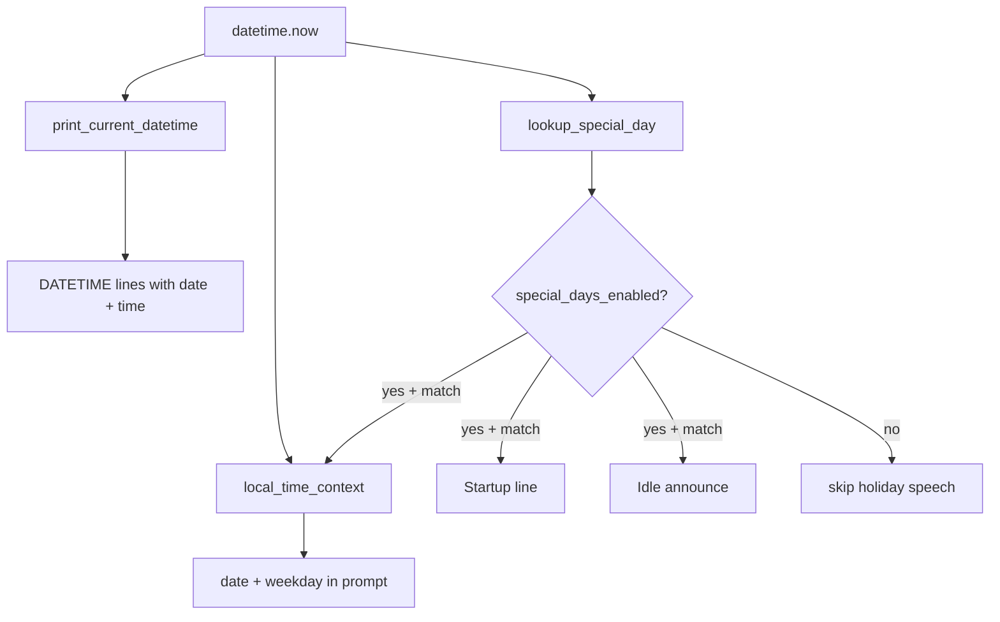

# Datum und Special Days

## Entscheidungen (fest)
- Feiertage: **internationale** Tage aus mehreren Ländern **plus Joke-/Fun-Tage** (englische Lines)
- Feiertags-Kommentar: **Start** + **Idle-Chance**, **nicht** bei Menü „Tell Time“
- Tell Time sagt **immer Datum und Zeit zusammen** (kein Feiertags-Anhang)

## Architektur

## 1. Datum in Ansagen und LLM

**[`kinito/features/programs.py`](kinito/features/programs.py)** — `print_current_datetime()`:
- Immer sowohl `{date}` als auch `{time}` einsetzen
- Format z.B. `{date}` = `Monday, July 28`, `{time}` = `%H:%M`
- Line aus `DATETIME_RESPONSES` (oder erweiterte `TIME_RESPONSES` mit beiden Placeholders)
- **Kein** Feiertags-Text hier

**[`content/dialogue.py`](content/dialogue.py)**:
- `TIME_RESPONSES` zu Datetime-Lines umbauen bzw. durch `DATETIME_RESPONSES` ersetzen (beide Placeholder `{date}` und `{time}`), damit bestehende Aufrufer weiter funktionieren

**[`content/llm_prompts.py`](content/llm_prompts.py)** — `local_time_context()`:
- zusätzlich Wochentag + Datum (`Monday, July 28, 2026`)
- wenn Setting an und heute ein Special Day: kurzer Hinweis (`Today is Valentine's Day.`)

## 2. Special-Days-Content

Neu: **[`content/special_days.py`](content/special_days.py)**
- Lookup nach `(month, day)` plus Regel-Tage (Friday the 13th, US Thanksgiving = 4. Donnerstag im Nov)
- Pro Tag: `name`, optional `kind` (`international` / `joke`), mehrere Kinito-Lines (`{name}`-Placeholder)
- API: `special_day_for(now) -> SpecialDay | None`, `pick_special_day_line(day) -> str`
- Bei mehreren Matches am selben Tag: einen zufällig wählen

### Internationale / landesbezogene Tage (Auswahl)
- New Year’s Day, New Year’s Eve
- Valentine’s Day, White Day (Mar 14, JP/KR/TW)
- International Women’s Day (Mar 8)
- St. Patrick’s Day (Mar 17)
- May Day / International Workers’ Day (May 1)
- Cinco de Mayo (May 5)
- Canada Day (Jul 1)
- US Independence Day (Jul 4)
- Bastille Day (Jul 14)
- Halloween (Oct 31)
- Día de los Muertos (Nov 1–2; Nov 1 als Einstieg)
- Thanksgiving US (berechnet)
- Christmas Eve, Christmas Day
- Boxing Day (Dec 26)

### Joke- / Fun-Tage (Auswahl)
- April Fools’ Day (Apr 1)
- Pi Day (Mar 14) — kollidiert ggf. mit White Day → Zufallswahl
- Star Wars Day (May 4, „May the 4th“)
- Friday the 13th (jeder 13. der Freitag ist)
- World Emoji Day (Jul 17)
- International Cat Day (Aug 8)
- International Dog Day (Aug 26)
- Talk Like a Pirate Day (Sep 19)
- National Coffee Day (Sep 29)
- Halloween Eve vibes optional weglassen; dafür Programmer’s Day (Sep 13, oder Tag 256 = Sep 13 in Nicht-Schaltjahren — fest Sep 13 reicht)
- Singles’ Day (Nov 11)
- Festivus (Dec 23)

## 3. Setting-Toggle „Special Days“

Spiegel Screen-Effects:

| Schicht | Änderung |
|---------|----------|
| [`kinito/settings_store.py`](kinito/settings_store.py) | `"special_days_enabled": True` |
| [`kinito/app.py`](kinito/app.py) | `_special_days_enabled` laden + `_persist_settings` |
| Feature-Methode | `toggle_special_days()` (sinnvoll in neuem kleinen Mixin oder an `ProgramsMixin` / Content) |
| [`content/dialogue.py`](content/dialogue.py) | `BUTTON_SPECIAL_DAYS_ON/OFF`, `SPECIAL_DAYS_ON/OFF_LINES` |
| [`content/dialog_registry.py`](content/dialog_registry.py) | Label in `settings_options_for`, Handler |
| [`content/menu_visibility.py`](content/menu_visibility.py) | `settings.special_days` |

## 4. Trigger: Start + Idle (nicht Tell Time)

**Start** — [`kinito/app.py`](kinito/app.py) `_play_startup_line`:
- wenn `_special_days_enabled` und heute ein Match: Special-Day-Line sprechen statt normaler `STARTUP_LINES`
- sonst unverändert

**Idle** — [`kinito/features/content.py`](kinito/features/content.py) / Movement:
- neue Aktion `maybe_announce_special_day()` (oder immer in `perform_random_menu_action`-Pool, die intern no-op’t wenn Setting aus / kein Match)
- bei Treffer: eine Special-Day-Line sprechen
- **nicht** an `print_current_datetime` hängen

## 5. Tests

- `tests/test_special_days.py` — Lookup (feste Tage, Friday 13th, Thanksgiving), Line-Pick, Kollision (z.B. Mar 14)
- Tell-Time-Test: `print_current_datetime` enthält immer Datum **und** Zeit (ohne Holiday)
- Settings-Roundtrip + `settings_options_for` / Dialog-Handler wie bei anderen Toggles
- LLM-Zeitkontext enthält Datum; Holiday-Hinweis nur wenn Setting an

## Nicht im Scope
- Keine rein deutschen Feiertage / keine beweglichen Kirchenfeiertage (Ostern o.Ä.)
- Kein Feiertags-Anhang beim Tell-Time-Button
- Keine reine Zeit- oder reine Datums-Ansage bei Tell Time
