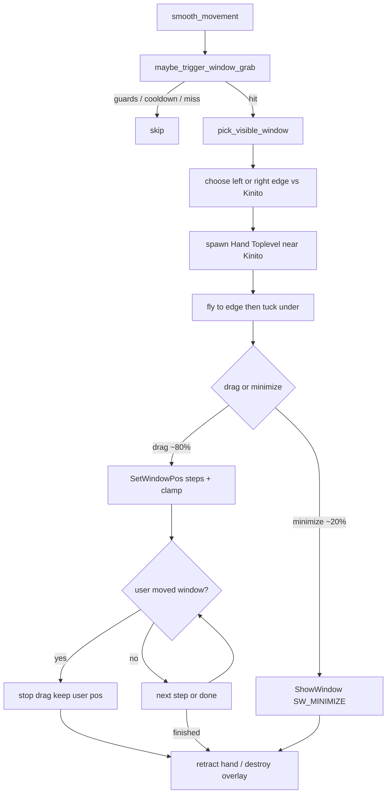

# Fenster greifen und verziehen (Hand-Overlay)

## Entscheidungen (fest)

- **Kinito bewegt sich nicht** — nur eine Hand als eigenes borderless `Toplevel` fliegt von Kinito zur Fensterseite.
- **Trigger:** selten ambient im Roaming-Loop (wie Glitch/Nudges), mit Cooldown.
- **Aktion:** ~80 % verziehen (beliebige Richtung X/Y), ~20 % minimieren — **nie schließen**.
- **Griffpunkt:** linke/rechte Fensterkante (`HandToLeft` / `HandToRight`); Verschiebung danach frei 2D.
- **Griff / Look:** Hand fliegt von Kinito zur Kante und liegt danach **halb unter dem Fenster**, damit es wie echtes Greifen wirkt.
- **Sichtbarkeit:** Fenster dürfen auf andere Monitore; Zielposition so clampen, dass ein Streifen der Titelleiste im Virtual Desktop bleibt.
- **User-Übernahme:** Während des automatischen Verziehens darf der User das Fenster selbst greifen und neu positionieren (wie Surfen abbrechen, wenn man Kinito greift). Danach **kein** Weiterziehen durch Kinito — Sequenz sofort abbrechen, Hand einziehen, Fenster an der User-Position belassen.
- **Toggle:** Settings-Schalter (Default an), analog Reminder — sonst nervt das Feature zu schnell.

## Visualisierung (Hand-Griff)

Referenz: Sprites `GameAssets/sprites/Hand/HandToLeft.png` und `HandToRight.png` (hellblaue Handschuhe).

```text
  [Kinito] ----fliegen---->  |Fenster|
                              ╚═Hand═╝   ← ca. 40–50% der Hand unter dem Rand
```

- **Start:** Hand-Overlay spawnt nahe bei Kinito (zur Zielseite hin).
- **Flug:** in ~8–12 Frames zur Griffposition an linker bzw. rechter Kante.
- **Tuck:** Endposition so, dass etwa die Hälfte des Sprites in die Fensterfläche ragt (linke Kante → `HandToRight`, rechte Kante → `HandToLeft`). Vertikal etwa mittig an der Seitenkante (nicht nur Titelleiste).
- **Z-Order:** Hand-HWND **hinter** dem Zielfenster halten (`SetWindowPos` mit `hwndInsertAfter = target`), damit die überlappende Hälfte wirklich „unter“ dem Rahmen verschwindet. Nach jedem Drag-Schritt Z-Order + Position nachziehen.
- **Während Drag:** Hand klebt an der Kante mit demselben Tuck-Offset mit; bei User-Abort sofort einziehen/zerstören.
- Hand-`Toplevel` selbst: `overrideredirect`, weiß transparent — **nicht** dauerhaft über dem Zielfenster als TOPMOST (sonst wirkt der Griff flach obenauf).

## Ablauf



## Win32-Schicht

Neue Hilfen in [`kinito/window_targets.py`](kinito/window_targets.py) (ctypes, Windows-only; Pattern wie [`kinito/app_context.py`](kinito/app_context.py) / [`kinito/app.py`](kinito/app.py)):

- Kandidaten: sichtbare Top-Level-HWNDs (`IsWindowVisible`, kein Owner, kein `WS_EX_TOOLWINDOW`)
- Ausschluss: Kinitos eigene HWNDs (`root` + bekannte Toplevels), bereits minimiert (`IsIconic`), optional maximiert nur für Drag überspringen (Minimize trotzdem ok)
- `GetWindowRect` → `(hwnd, left, top, right, bottom)`
- `set_window_pos(hwnd, x, y)` via `SetWindowPos` (`SWP_NOSIZE | SWP_NOZORDER | SWP_NOACTIVATE`)
- `minimize_window(hwnd)` via `ShowWindow(SW_MINIMIZE)` — gezielter als `Win+↓`
- `clamp_window_origin(x, y, w, h, virtual_rect)` — hält ~40 px Titelleisten-Streifen im Virtual Screen (`SM_*VIRTUALSCREEN`, wie `get_screen_bounds`)

Auswahl: zufälliges Kandidatenfenster in Reichweite (z. B. Abstand Kinito-Mitte → Fensterkante unter Schwellwert, sonst nächstes); Seite = Kante näher an Kinito → Spritewahl.

## Feature-Mixin

Neue Datei [`kinito/features/window_grab.py`](kinito/features/window_grab.py) + Mixin in [`kinito/app.py`](kinito/app.py):

| Konstante | Wert |
|---|---|
| `WINDOW_GRAB_CHANCE` | `1/450` (störender als Nudges) |
| `WINDOW_GRAB_COOLDOWN_SECONDS` | `420` (~7 min) |
| `WINDOW_GRAB_MINIMIZE_CHANCE` | `0.2` |
| `WINDOW_GRAB_DRAG_DISTANCE` | ca. 120–280 px zufällig in zufälliger Richtung |

`maybe_trigger_window_grab()`:

- Guards wie Nudges: Feature-Flag, Focus, Game, Pause, Drag/Throw, Camera, Browser, Speech busy, `_window_grab_active`
- Chance + Cooldown → `root.after(0, self._run_window_grab)`

`_run_window_grab()` (Tk-Thread):

1. Ziel-HWND + Seite wählen; bei Miss abbrechen
2. Hand-`Toplevel`: `overrideredirect`, transparent white; Sprite `tk_img_hand_left` / `tk_img_hand_right`
3. Start nahe Kinito → Flug zur Kante → **Tuck** (~50 % Sprite unter dem Rand) + Z-Order hinter Zielfenster
4. **Drag:** Zieloffset wählen → Zwischenpositionen mit Clamp → Hand mit Tuck an der Kante nachführen; optional Zeile aus `content/window_grab_lines.py`
5. **User-Abort (wie Surf-Interrupt):** Nach jedem `SetWindowPos`-Schritt `GetWindowRect` lesen. Weicht die Ist-Position merklich von der zuletzt gesetzten ab (Toleranz ~8–16 px), Drag **sofort beenden** — kein weiteres Ziehen, Hand einziehen, Fenster an User-Position belassen.
6. **Minimize:** `ShowWindow(SW_MINIMIZE)`, Hand kurz „ziehen“ dann weg
7. Overlay zerstören, Flag zurücksetzen; abgebrochenes Fenster nicht in derselben Sequenz erneut anfassen

Kein `move_towards` für Kinito. Hilfsfunktion z. B. `_hand_tuck_geometry(side, window_rect, hand_w, hand_h)` für konsistente Griffposition.

## Assets & Content

- [`kinito/assets.py`](kinito/assets.py): `sprites_hand_directory`, Pfade `HandToLeft.png` / `HandToRight.png`
- [`kinito/app.py`](kinito/app.py): PhotoImages laden (`_open_sprite`)
- [`content/window_grab_lines.py`](content/window_grab_lines.py): kurze mischievous Lines
- [`content/dialogue.py`](content/dialogue.py) + [`content/dialog_registry.py`](content/dialog_registry.py): Settings-Button „Window Play“ On/Off + Feedback-Lines
- Persistenz über bestehendes `_persist_settings` / Settings-Dict (Flag `_window_grab_enabled`)

## Integration

In [`kinito/movement.py`](kinito/movement.py) `smooth_movement` neben den anderen Ambient-Triggern:

```python
self.maybe_trigger_window_grab()
```

Windows-only: auf Nicht-Windows no-op (wie Minimize-Easter-Egg dokumentieren).

## Tests

- [`tests/test_window_targets.py`](tests/test_window_targets.py): Clamp (inkl. Multi-Monitor-Rect wie `(-1920,0,3840,1080)`), Sprite-Seitenwahl, Ausschlussfilter (Mocks)
- [`tests/test_window_grab.py`](tests/test_window_grab.py): Chance/Cooldown/Guards, Drag vs Minimize, **Tuck-Geometrie** (Hand halb unter Kante), User-Abort, Overlay-Cleanup

## README

Kurzer Hinweis unter Windows-Features + FAQ: Fenster werden absichtlich verschoben/minimiert, Toggle im Settings-Menü; nie geschlossen. Während des Ziehens kann der User das Fenster selbst übernehmen — Kinito lässt dann los.
