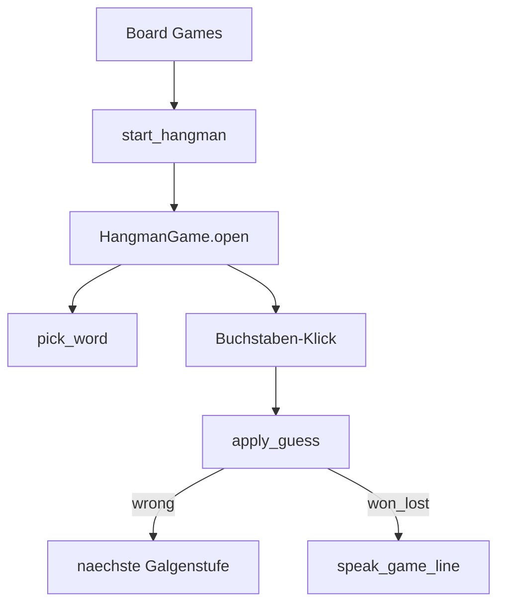

# Hangman unter Board Games umsetzen

## Wortquelle: feste Liste, keine Library

**Empfehlung und Festlegung: keine externe Word-Library.** Stattdessen eine **kuratierte Liste** im Repo, analog zu [`content/trivia_questions.py`](content/trivia_questions.py).

| | Kuratierte Liste | Word-Library / Wörterbuch |
|--|------------------|---------------------------|
| Qualität | Nur echte, spielbare Wörter | Oft Fach-/Seltenwörter, Tippfehler |
| Ton | Passt zu Kinito (freundlich, erkennbar) | Zufällig, unkontrollierbar |
| Abhängigkeit | Keine | Extra-Package, Lizenz, Größe |
| LLM im Chat | Genau das Problem, das du hattest | — |

**Zielgröße:** ca. **120–180** englische Wörter (App-UI ist Englisch), Länge 4–10 Buchstaben, nur `A–Z`, keine Bindestriche/Leerzeichen. Datei: [`content/hangman_words.py`](content/hangman_words.py) mit `WORDS: tuple[str, ...]` und `pick_word(...)`.

Später erweiterbar (mehr Wörter / Kategorien) ohne Architekturwechsel — nur die Liste pflegen.

## Festlegungen

- **Menü:** Board Games (Fenster; 26 Buchstaben passen nicht gut in die Bubble)
- **Pfad:** Actions → Play Game → Board Games → Hangman
- **Leben:** 6 Fehlversuche (klassische Galgen-Stufen)
- **Eingabe:** Button-Grid A–Z; bereits geratene Buchstaben deaktivieren
- **Gegner:** Solo-Rätsel (Wort vom Pool), Kinito kommentiert bei Gewinn/Niederlage
- **Galgen:** Text-/Label-Stufen (ASCII reicht), kein Canvas nötig

## Schritt 1 — Wortliste

Neue Datei [`content/hangman_words.py`](content/hangman_words.py):

- `WORDS`: Tuple aus uppercase Strings (manuell kuratiert)
- `pick_word(rng=None, *, used=None)`: zufällig, optional ohne zuletzt genutzte Wörter in der Session
- Keine LLM-/Chat-Anbindung für die Wortwahl

## Schritt 2 — Dialog / Lines

[`content/dialogue.py`](content/dialogue.py): `BUTTON_GAME_HANGMAN = "Hangman"`

[`content/game_lines.py`](content/game_lines.py):

- `HANGMAN_WIN_LINES` (optional `{word}`)
- `HANGMAN_LOSE_LINES` (mit `{word}` — Wort aufdecken)
- Optional `HANGMAN_CLOSE_LINES` nicht nötig (`GAME_CLOSED_LINES` reicht)

## Schritt 3 — Logik (`hangman.py`)

Neue Datei [`kinito/features/games/hangman.py`](kinito/features/games/hangman.py) — reine Logik + UI in einer Datei (wie Connect Four / Tic-Tac-Toe):

| API | Aufgabe |
|-----|---------|
| `MAX_MISSES = 6` | Fehlversuche |
| `new_game(word)` | State: `word`, `revealed` (Bool-Liste), `guessed` (set), `misses`, `status` (`playing`/`won`/`lost`) |
| `apply_guess(state, letter)` | Normalisieren auf A–Z; Duplikat ignorieren; Treffer → `revealed`; Fehl → `misses++`; ggf. `won`/`lost` |
| `display_word(state)` | z.B. `"C _ T"` |
| `HANGMAN_STAGES` | 7 Strings (0–6 misses) für das Galgen-Label |

## Schritt 4 — UI (`HangmanGame`)

In derselben Datei:

1. `open()` → `open_game_window(app, "Hangman with Kinito", …)`
2. Galgen-Label (`font=Courier` / monospace) + Wort-Label + Status („Misses: n/6“)
3. Frame mit 26 Buttons A–Z (2–3 Zeilen); Klick → `apply_guess` → UI update; Button disable
4. Bei `won`/`lost`: restliche Letter-Buttons sperren, Wort voll zeigen, `speak_game_line`
5. **New Game** → neues `pick_word`, UI reset
6. Session: kurze `used`-Menge, damit dasselbe Wort nicht sofort wiederkommt

## Schritt 5 — Verdrahtung

[`kinito/features/games/__init__.py`](kinito/features/games/__init__.py): `start_hangman()` → `HangmanGame(self).open()`

[`content/dialog_registry.py`](content/dialog_registry.py):

- Button in `BOARD_GAMES_MARKER`
- `_handle_board_games`: `BUTTON_GAME_HANGMAN` → `start_hangman`

README Mini-games-Zeile um Hangman ergänzen.

## Schritt 6 — Tests

[`tests/test_games.py`](tests/test_games.py):

- Alle `WORDS` nur A–Z, Länge 4–10
- Treffer deckt Buchstaben auf; Fehl erhöht `misses`
- Gewinn wenn alle Buchstaben geraten; Verlust bei 6 Misses
- Doppelter Guess ändert State nicht
- `pick_word` liefert Eintrag aus `WORDS`

[`tests/test_dialog_handlers.py`](tests/test_dialog_handlers.py): Board Games → Hangman → `start_hangman`

## Reihenfolge

1. `hangman_words.py` + Logik-Tests  
2. UI in `hangman.py`  
3. Dialog / Mixin / Registry  
4. Handler-Tests  

## Abgrenzung

- Keine Word-Library, kein LLM für Wörter
- Keine Kategorien/Schwierigkeitsstufen in v1
- Kein Canvas/Sprite-Galgen
- Kein Hotseat / vs. Kinito-Wort-raten (nur Solo)