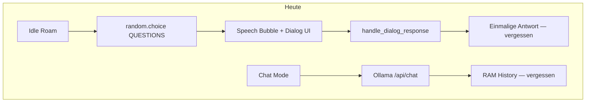
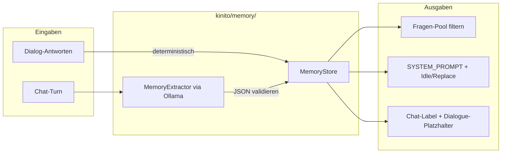

# Kinito Memory-System

## Ausgangslage

Heute gibt es **keine persistente Erinnerung**:
- Spontane Fragen kommen per `random.choice(QUESTIONS)` ohne Filter ([`kinito/features/content.py`](kinito/features/content.py))
- Antworten wie beim Namen werden nur einmal gesprochen (`_text_format` in [`content/dialog_registry.py`](content/dialog_registry.py)), aber **nicht gespeichert**
- Chat-Kontext lebt nur in `ConversationHistory` (max. 20 Turns, Reset bei Chat-Ende) ([`kinito/llm/conversation.py`](kinito/llm/conversation.py))
- `CHAT_USER_LABEL = "Ben"` ist hardcoded ([`content/llm_prompts.py`](content/llm_prompts.py))



## Empfehlung: Hybrid statt reiner `.d`-Dateien

Deine Idee (KI schreibt Stichpunkte in eine Datei) passt gut zum Charakter von Kinito — aber **reine `.d`-Fragmente** sind für Updates/Entfernen/Deduplizierung unhandlich.

**Besserer Kompromiss (ohne DB):**

| Datei | Inhalt | Wer schreibt |
|-------|--------|--------------|
| [`GameAssets/UserMedia/memory.json`](GameAssets/UserMedia/memory.json) | Strukturierte Fakten + Metadaten | Code (Dialog-Antworten) + validierte KI-Extraktion |
| [`GameAssets/UserMedia/notes.txt`](GameAssets/UserMedia/notes.txt) | Menschenlesbare Stichpunkte (optional gespiegelt) | Code schreibt nach KI-Entscheidung |

Die KI **entscheidet**, was sie merken will — aber **schreibt nicht direkt auf die Platte**. Stattdessen liefert sie strukturiertes JSON (`add` / `remove` / `update`), und ein kleines Python-Modul validiert und persistiert. Das verhindert kaputte Dateien und erlaubt trotzdem „Kinito merkt sich das von selbst“.

---

## Architektur (Ziel)



---

## Phase 1 — MemoryStore (Fundament)

**Neues Modul:** `kinito/memory/store.py`

**Pfad:** `GameAssets/UserMedia/memory.json` (neben bestehendem [`user_media_directory`](kinito/assets.py))

**Schema (Vorschlag):**

```json
{
  "version": 1,
  "facts": {
    "user_name": "Alex",
    "favorite_color": "blau",
    "favorite_food": "Pizza",
    "hobby": "Zeichnen",
    "pet": "Katze Mitzi",
    "favorite_music": "…"
  },
  "answered_markers": ["What should I call you?", "What's your favorite color?"],
  "notes": [
    {"text": "Arbeitet oft spät am PC", "source": "chat", "created": "2026-07-10"}
  ]
}
```

**API:**
- `load()` / `save()` — atomar schreiben (`temp` + `rename`)
- `set_fact(key, value)` / `get_fact(key)`
- `mark_answered(marker)` / `is_answered(marker)`
- `add_note(text)` / `remove_note(text)` — siehe [Kapazitäts-Limits](#kapazitäts-limits)
- `as_prompt_block()` — kompakter Textblock für LLM-Prompts; nur die wichtigsten Einträge, hart begrenzt

**Init in** [`kinito/app.py`](kinito/app.py) → `_init_llm()` oder eigene `_init_memory()`; `ensure_user_media_directories()` erweitern.

**Tests:** `tests/test_memory_store.py` — load/save, answered_markers, prompt block.

---

## Kapazitäts-Limits

**Engpass ist der Ollama-Kontext, nicht Festplatte oder Python.** Mit dem Default-Setup (`llama3.2:3b`, `OLLAMA_MAX_HISTORY=20`) teilen sich System-Prompt, Memory-Block und Chat-Verlauf dasselbe Kontextfenster. Zu viel Memory macht Antworten langsamer, teurer (mehr Tokens) und verwässert den Fokus.

### Empfohlene Default-Limits (v1)

| Kategorie | Speicher (JSON) | Im Prompt (`as_prompt_block`) | Pro Eintrag |
|-----------|-----------------|-------------------------------|-------------|
| Strukturierte Fakten (`facts`) | max. 20 Keys | alle (immer) | max. 80 Zeichen |
| Chat-Notizen (`notes`) | max. 50 Einträge | max. 20 (neueste zuerst) | max. 120 Zeichen |
| Prompt-Block gesamt | — | max. ~800 Zeichen (~200 Tokens) | — |
| Pro Chat-Turn (Extractor) | max. 2 neue Notizen | — | — |

**Wichtig: „Pro Chat-Turn“ ≠ „Pro Chat-Session“.**
- **Chat-Turn** = ein einzelner Austausch: User schreibt etwas → Kinito antwortet → Extractor läuft einmal
- **Chat-Session** = der gesamte Chat vom Öffnen bis Schließen (kann 5, 20 oder 50 Turns haben)

Beispiel bei einem längeren Chat mit 15 Turns und durchschnittlich 1 relevanter Notiz pro Turn: **~15 neue Notizen** in einer Session — kein Problem, solange das Gesamt-Limit (50 gespeichert / 20 im Prompt) greift.

Das Limit von 2 pro Turn verhindert nur, dass **eine einzelne Nachricht** plötzlich 10 Stichpunkte erzeugt (z. B. wenn der User einen langen Lebenslauf schickt). Es bremst längeres Chatten nicht.

**Typisches Verhalten:** Der Extractor speichert nicht bei jedem Turn etwas — nur wenn der User einen **neuen, stabilen Fakt** nennt. In der Praxis eher 0–1 Notiz pro Turn, selten 2.

### Faustregel für den Nutzer

- **~15 Fakten + ~20 Notizen im Prompt** = sweet spot — fühlt sich persönlich an, belastet das System kaum
- **Ab ~40 Notizen gespeichert** (wenn alle in den Prompt kämen): spürbar mehr Latenz und schlechtere Antworten beim 3B-Modell
- **Ab ~100+ Notizen**: auch auf der Platte unübersichtlich; Kinito „erinnert sich an alles Mögliche“, aber nutzt es nicht sinnvoll

### Warum zwei Stufen (speichern vs. prompten)?

- **Auf Platte** darf mehr liegen (z. B. 50 Notizen) — für „What do you remember?“ und manuelles Editieren
- **In den Prompt** kommen nur die **20 neuesten** Notizen + alle Fakten — ältere Notizen bleiben archiviert, beeinflussen aber Chat/Idle nicht mehr
- Optional später: bei Überschreitung der 50 Notizen die ältesten automatisch löschen (FIFO)

### Technische Absicherung im Code

```python
MAX_FACTS = 20
MAX_FACT_VALUE_LEN = 80
MAX_NOTES_STORED = 50
MAX_NOTES_IN_PROMPT = 20
MAX_NOTE_LEN = 120
MAX_PROMPT_BLOCK_CHARS = 800
MAX_NEW_NOTES_PER_TURN = 2  # pro einzelnem User→Assistant-Austausch, nicht pro Session
```

`as_prompt_block()` bricht hart ab, wenn das Limit erreicht ist — lieber kürzen als den Kontext sprengen.

### Skalierung in der Zukunft

Mehr Memory **ohne** Architektur-Umbau ist möglich — aber zwei Hebel wirken unterschiedlich:

| Hebel | Was es bringt | Grenze |
|-------|---------------|--------|
| **Zahlen anpassen** (`MAX_NOTES_IN_PROMPT`, `MAX_PROMPT_BLOCK_CHARS`, …) | Schnell, kein Code-Umbau | Irgendwann wird der Prompt zu lang — auch große Modelle werden unruhiger |
| **Größeres Modell** (`OLLAMA_MODEL`, z. B. `llama3.1:8b`) | Mehr Kontext-Kapazität, bessere Nutzung langer Prompts | Langsamere Antworten, mehr RAM/VRAM |
| **Zwei-Stufen-Design (bereits im Plan)** | Speicher-Limit und Prompt-Limit getrennt skalieren | Archiv wächst, Prompt bleibt schlank |
| **Später optional** | Alte Notizen per KI zu Kurzfakten zusammenfassen, bevor sie aus dem Prompt fallen | Echter Schritt für „viel mehr“ Memory |

**Praxis:** Für „etwas mehr“ reichen oft **Zahlen erhöhen + 8B-Modell**. Für „hunderte Erinnerungen“ bräuchte man irgendwann **Zusammenfassung** (Notizen → Fakten komprimieren) — nicht nur ein größeres Modell.

---

- **Dialog-Fakten** (Name, Farbe, Essen, …): ~13 Keys — vernachlässigbar, immer mitgeben
- **`answered_markers`**: nur für Fragen-Filter, nicht in den LLM-Prompt
- **JSON-Dateigröße**: selbst 50 Notizen ≈ 5–10 KB — kein Performance-Problem

---

## Phase 2 — „Einmal fragen“ für persönliche Fragen

Deine Wahl: **nur persönliche Fakten** verschwinden aus dem Pool; Stimmungsfragen (`DAY_QUESTION`, `BORED`, `LONELY`, …) bleiben.

**Neue Datei:** `content/memory_keys.py` — Mapping Marker → Fact-Key:

| Marker (aus `dialogue.py`) | Fact-Key | UI-Typ |
|---------------------------|----------|--------|
| `NAME_QUESTION` | `user_name` | textbox |
| `COLOR_QUESTION` | `favorite_color` | textbox |
| `FOOD_QUESTION` | `favorite_food` | textbox |
| `HOBBY_QUESTION` | `hobby` | textbox |
| `PET_QUESTION` | `pet` | textbox |
| `BOOK_QUESTION` | `favorite_book` | textbox |
| `DRINK_QUESTION` | `favorite_drink` | textbox |
| `MOVIE_QUESTION` | `favorite_movie` | textbox |
| `SNACK_QUESTION` | `favorite_snack` | textbox |
| `PROGRAMMING_QUESTION` | `likes_programming` | buttons (yes/no) |
| `MUSIC_QUESTION` | `likes_music` | buttons |
| `COFFEE_QUESTION` | `likes_coffee` | buttons |
| `SEASON_QUESTION` | `favorite_season` | textbox |

**Filter in** [`kinito/features/content.py`](kinito/features/content.py) → `_available_spontaneous_questions()`:

```python
# Pseudocode
pool = [q for q in QUESTIONS if not memory.is_question_answered(q)]
```

`is_question_answered(text)` prüft, ob ein bekannter Marker in `answered_markers` steht.

**Persistenz bei Antwort:** Wrapper um Dialog-Handler in [`content/dialog_registry.py`](content/dialog_registry.py):
- `_text_format_with_memory(marker, key, lines)` — speichert Text-Antwort, markiert Marker, dann `speak`
- `_yes_no_with_memory(marker, key, yes_val, no_val, …)` — für Button-Fragen

Aufruf über `handle_dialog_response` oder erweiterte Handler-Factories — minimaler Eingriff, kein Umbau aller 30+ Specs auf einmal (erst die obige Liste).

---

## Phase 3 — Fakten in Dialoge und Chat einbauen

### Chat
- [`content/llm_prompts.py`](content/llm_prompts.py): `SYSTEM_PROMPT` um Block erweitern: `Known facts about the user:\n{memory}`
- [`kinito/features/llm.py`](kinito/features/llm.py) `send_chat_message()`: `messages_for_api(build_system_prompt(memory))`
- `CHAT_USER_LABEL` dynamisch aus `memory.get_fact("user_name")` oder Fallback „You“

### Idle / AI-Ersatzzeilen
- [`kinito/features/llm.py`](kinito/features/llm.py) `_build_generation_prompt()` und `speak_ai_idle_line()`: Memory-Block anhängen (wie bestehendes `append_time_context_if_needed`)

### Scriptierte Zeilen (optional, Phase 3b)
- Ausgewählte Pools in [`content/dialogue.py`](content/dialogue.py) mit `{user_name}` erweitern
- In `SpeechMixin.speak()` vor dem Anzeigen: `text.format(user_name=memory.get_fact("user_name") or "friend")` — nur wenn Platzhalter vorhanden (try/except oder Regex)

---

## Phase 4 — KI-Notizen aus dem Chat

**Neues Modul:** `kinito/memory/extractor.py`

Nach jedem erfolgreichen Chat-Turn (Hintergrund-Thread in `_on_chat_response`):

1. Kleiner Ollama-Call mit `MEMORY_EXTRACT_PROMPT` (neu in `content/llm_prompts.py`)
2. Erwartetes JSON:
   ```json
   {"add_notes": ["…"], "remove_notes": ["…"], "update_facts": {"hobby": "…"}}
   ```
3. Strikt validieren (nur erlaubte Keys, max. Länge, keine leeren Strings)
4. `MemoryStore` aktualisieren + optional `notes.txt` spiegeln

**Prompt-Regeln für die KI:**
- Nur stabile, vom User genannte Fakten — keine Vermutungen
- Keine sensiblen Daten (Passwörter, Adressen) speichern
- Bei Unsicherheit: lieber nichts speichern
- `update_facts` nur für bekannte Keys aus `memory_keys.py`

**Ohne Ollama:** Phase 2 (Dialog-Fakten) funktioniert trotzdem; Chat-Extraktion wird übersprungen.

---

## Phase 5 — UX & „coole Extras“

Diese Punkte fehlen in der Grundidee, lohnen sich aber:

1. **„Vergiss mich“ / Memory zurücksetzen** — Menüeintrag im Rechtsklick-Menü ([`content/dialog_registry.py`](content/dialog_registry.py) `_handle_menu`), löscht `memory.json` + `notes.txt`, setzt `answered_markers` zurück
2. **Memory anzeigen** — optionaler Menüpunkt „What do you remember?“ → Kinito liest kompakte Zusammenfassung vor (aus `as_prompt_block()`)
3. **Persönliche Begrüßung** — Startup-/Chat-Greeting mit Namen, wenn bekannt
4. **Zeitstempel auf Notizen** — alte Chat-Notizen später bereinigen oder überschreiben
5. **Manuell editierbar** — `notes.txt` und `memory.json` liegen im User-Ordner; README-Eintrag in [`GameAssets/UserMedia/README.txt`](GameAssets/UserMedia/README.txt)

---

## Was bewusst nicht in v1

- Vektor-DB / Embeddings / semantische Suche — Overkill für lokales Pet
- Memory über mehrere Windows-User-Profile — ein Datei-Set pro Installation reicht
- KI schreibt rohe `.d`-Fragmente — ersetzt durch JSON + optionale `notes.txt`
- Alle 30+ Fragen auf einmal — nur persönliche Fakten laut deiner Auswahl

---

## Betroffene Dateien (Kern)

| Aktion | Datei |
|--------|-------|
| Neu | `kinito/memory/store.py`, `kinito/memory/extractor.py`, `content/memory_keys.py` |
| Ändern | [`kinito/features/content.py`](kinito/features/content.py), [`content/dialog_registry.py`](content/dialog_registry.py), [`kinito/features/llm.py`](kinito/features/llm.py), [`content/llm_prompts.py`](content/llm_prompts.py), [`kinito/assets.py`](kinito/assets.py), [`kinito/app.py`](kinito/app.py) |
| Tests | `tests/test_memory_store.py`, `tests/test_memory_questions.py`, `tests/test_memory_extractor.py` (mit Mock) |
| Doku | [`README.md`](README.md) Abschnitt „Memory“, [`GameAssets/UserMedia/README.txt`](GameAssets/UserMedia/README.txt) |

---

## Implementierungsreihenfolge

Empfohlen in 4 kleinen Schritten (jeweils testbar):

1. **MemoryStore** + Laden beim Start
2. **Dialog-Persistenz** + Fragen-Filter (sofort spürbar: Name-Frage kommt nicht wieder)
3. **Prompt-Injection** (Chat + Idle kennen Fakten)
4. **Chat-Extraktor** + Reset-Menü
