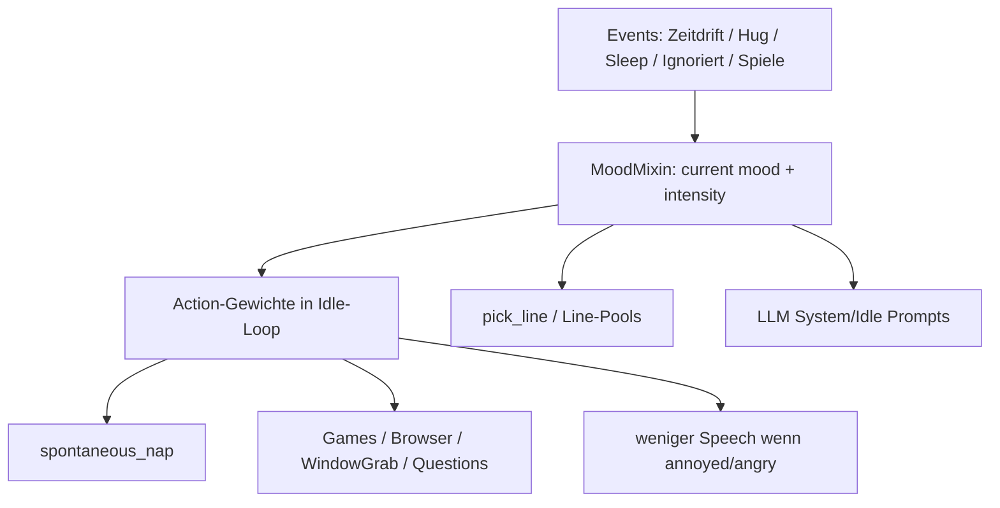

# Kinito Mood System

## Ansatz

Ein neues **diskretes Mood** als Laufzeit-Zustand, der sich von `neutral` aus langsam verschiebt und Aktionen sowie Sprechweise beeinflusst. Keine neuen Sprite-Assets (Müdigkeit zeigt sich über häufigeres Sleepen; Ton über Dialog/LLM).

**Moods:** `neutral`, `happy`, `bored`, `tired`, `annoyed`, `sad`, `angry`

**Defaults:** Session-Zustand mit sanftem Drift; aktuelle Mood wird leicht in Memory gespiegelt (für Kontinuität nach Neustart), verfällt aber nach ein paar Stunden Richtung `neutral`.

## Kernmodul

Neues Mixin [`kinito/features/mood.py`](kinito/features/mood.py) + Einbindung in [`kinito/app.py`](kinito/app.py) (wie Hug/Content):

- `self._mood` / `self._mood_intensity` (0.0–1.0)
- `get_mood()`, `set_mood()`, `shift_mood(delta_or_target, amount)` mit Transition-Tabelle
- Periodischer Drift: alle paar Idle-Zyklen kleine Chance, von `neutral` in eine andere Mood zu wechseln bzw. Intensity abzubauen Richtung `neutral`
- `mood_action_weights()` → Dict für Aktionen (nap, games, browser, window_grab, questions, hug_ask, speech_chance_mult)
- `mood_tone_hint()` → kurzer String für LLM und Dialog-Auswahl

**Beispiel-Gewichte (Richtung):**

| Mood | Verhalten |
|------|-----------|
| `tired` | ↑ Nap, ↓ Games/Browser/Window, etwas ↓ Speech |
| `bored` | ↑ Games, Browser, Questions, Window-Grab, Facts |
| `annoyed` / `angry` | ↓ Speech-Chance, ↓ Einladungen, ↑ passive-aggressive Lines |
| `happy` | ↑ Hug-Ask, Games, freundliche Lines |
| `sad` | ↑ Hug-Ask, etwas ↓ laute Actions, weichere Lines |
| `neutral` | heutige Baseline |

## Idle-Loop und Actions

In [`kinito/movement.py`](kinito/movement.py) (`smooth_movement`):

- `SPONTANEOUS_CHANCE` mit `speech_chance_mult` der Mood multiplizieren
- Ambient-Chancen (z.B. Window-Grab) mood-gewichtet

In [`kinito/features/content.py`](kinito/features/content.py) `perform_random_menu_action`:

- Statt `random.choice(actions)` **gewichtete** Auswahl (`random.choices` + Mood-Weights)
- `spontaneous_nap` / `offer_game_picker` / `offer_browser_visit` / `ask_for_hug` stark mood-abhängig

Optional leicht in [`kinito/features/window_grab.py`](kinito/features/window_grab.py) / Nudges: bored ↑, annoyed ↓.

## Dialog und LLM

1. **Helper** in [`content/dialogue.py`](content/dialogue.py): `pick_line_for_mood(lines, mood, intensity)` — wenn Pools getaggt sind, bevorzugte Varianten; sonst Fallback auf `pick_line`.

2. **Mood-getönte Mini-Pools** (nicht alles umbauen): neue/erweiterte Listen für häufige Idle-Pfade, z.B. in [`content/mood_lines.py`](content/mood_lines.py):
   - kurze Idle-Snippets / Decline-Varianten / Nap-Wake / Hug-Reaktionen pro Mood
   - `DECLINED_ACK`-ähnliche annoyed/angry Varianten stärker gewichten

3. **LLM** in [`content/llm_prompts.py`](content/llm_prompts.py) + [`kinito/features/llm.py`](kinito/features/llm.py):
   - `mood_tone_hint()` in `_build_generation_prompt` / Idle-Hints einspeisen
   - z.B. annoyed → knapper, passiv-aggressiv; tired → langsamer/müder Ton; happy → verspielter

4. Wichtige Call-Sites umstellen, die oft spontan sprechen: Idle-Fallbacks, Hug-Lines, Pause/Unpause, ggf. `pick_declined_line`.

## Hug / Sleep als Mood-Events

[`kinito/features/hug.py`](kinito/features/hug.py) nach erfolgreichem Hug:

- `sad` / `tired` / `annoyed` → oft leichte Verbesserung (Intensity runter oder Richtung `neutral`/`happy`)
- `angry` → selten Besserung, manchmal bleibt angry oder nur Intensity −klein
- `happy` → kann happy verstärken
- Nie harter Reset auf `neutral`

[`kinito/app.py`](kinito/app.py) `pause` / `unpause` / `_wake_from_spontaneous_nap`:

- Einschlafen wenn `tired`: oft leichte Erholung beim Aufwachen
- Nap wenn `bored`/`annoyed`: Mood oft **nicht** weg; manchmal sogar genervter („zu kurz“)
- Manuelles Sleep ähnlich, etwas stärker positiv bei `tired`

Hug abgelehnt (Dialog-Handler): kleine Chance Richtung `sad`/`annoyed`.

## Persistenz (leicht)

- Fact-Key z.B. `kinito_mood` + Timestamp in bestehendem Memory-Store ([`content/memory_keys.py`](content/memory_keys.py))
- Beim Start laden; wenn älter als ~4–6h → Richtung `neutral` starten
- Kein schweres Schema, nur Spiegel des aktuellen Zustands

## Tests

[`tests/test_mood.py`](tests/test_mood.py) (neu):

- Transitionen / Intensity-Clamping
- Gewichte: `tired` bevorzugt Nap, `bored` bevorzugt Play/Browser
- Hug/Sleep verschieben Mood nicht hart auf neutral
- `pick_line_for_mood` / Prompt-Hint enthalten Mood

Bestehende Games/Idle-Tests nur anfassen, falls Call-Signaturen sich ändern.

## Nicht im Scope

- Neue Sprite-Sets für happy/sad/angry
- UI-Badge „Mood: …“
- Volle Retaggung aller ~1700 Dialogue-Zeilen (nur zentrale Pools + LLM + Action-Weights)
