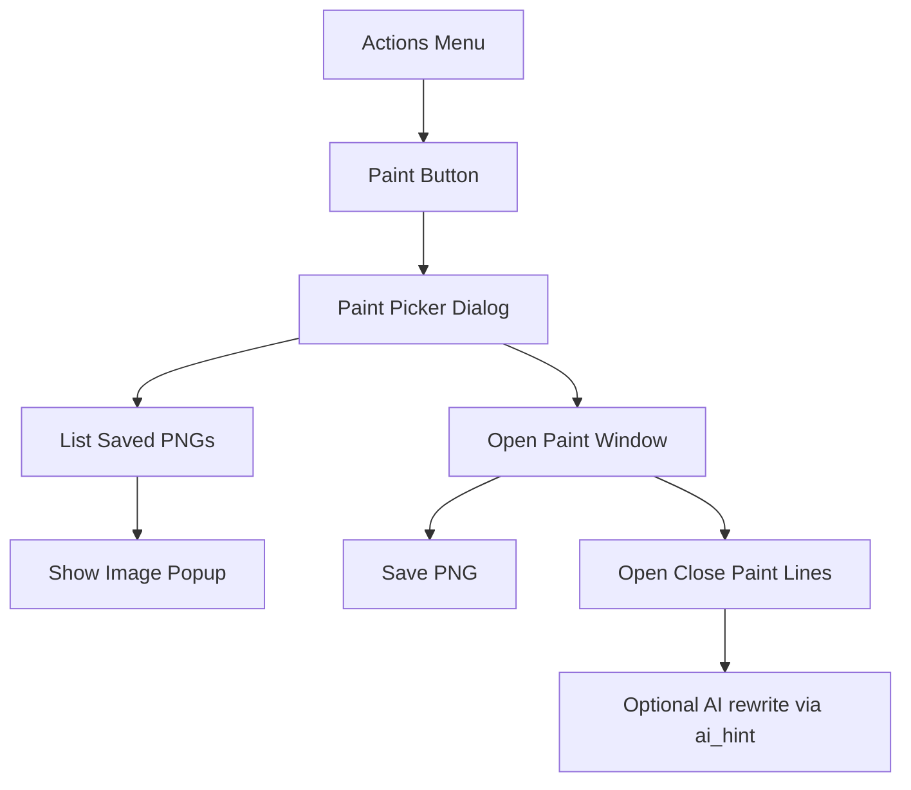

# Kinito Paint Feature

## Entscheidungen (fest)

- **Menü:** eigener Actions-Button **Paint** → Untermenü **Draw** / **My Paintings** / Back
- **KI & Bild:** in v1 **kein** Vision/Bild-Upload; Reaktionen über feste Lines + LLM-Rewrite/`ai_hint` (wie Hug). „KI malt mit“ und echte Bildverarbeitung sind **später** vielleicht, nicht Teil dieses Plans
- **Formen v1:** Linie, Kreis, Rechteck
- **Speicherort:** `GameAssets/UserMedia/paintings/*.png` (gitignore wie übriges UserMedia)

## Architektur

Pattern: neues Feature-Mixin analog zu Spielen/Hug, Fenster analog zu [`open_game_window`](kinito/features/games/base.py) (eigenes `_paint_window`, nicht das Game-Fenster blockieren — Paint und ein Mini-Spiel können konzeptionell getrennt bleiben; beim Öffnen von Paint trotzdem bestehendes Paint-Fenster schließen).

## UI (Paint-Fenster)

Layout angelehnt an [`ai-info/kinito-paint-window.jpg`](ai-info/kinito-paint-window.jpg), nicht pixelgenau:

| Bereich | Inhalt |
|---------|--------|
| Links | Tool-Grid: Radierer, Stift, Spray, Linie, Kreis, Rechteck |
| Darunter | Aktuelle Farbe (großes Preview-Quadrat) |
| Darunter | Tip-Optionen: 3 Kreise + 3 Rechtecke (groß/mittel/klein) |
| Rechts | Weiße Zeichenfläche (`tk.Canvas`) |
| Unten | Farbpalette (~20–28 Swatches, Win95-ähnlich) |
| Titlebar | z.B. `untitled - Paint`; Save-Button oder „Save“ in der Toolbar |

**Zeichenlogik (tk.Canvas + optional Pillow-Bitmap für Spray/Export):**

- **Stift / Radierer:** Freehand mit gewählter Tip-Form (Kreis/Rechteck) und Größe
- **Spray:** zufällige Punkte im Tip-Radius um den Cursor
- **Linie / Kreis / Rechteck:** Drag von Start- zu Endpunkt, Preview während Drag
- **Farbe:** Palette setzt Stroke/Fill; Preview-Quadrat aktualisiert sich
- **Export:** Canvas → PNG via Pillow (`ImageGrab` vom Canvas-Bereich oder offscreen `Image` parallel zeichnen — bevorzugt paralleles Pillow-Image, damit Save zuverlässig und unabhängig von Window-Scale ist)

Win95-Look mit tkinter-Bevels/grauem Frame und einfachen Icon-Buttons (Text/Unicode oder kleine gezeichnete Icons auf Canvas-Buttons — keine Asset-Pflicht für v1).

## Menü & Dialoge

Anbindung wie bestehende Actions:

1. [`content/dialogue.py`](content/dialogue.py) — Marker/Fragen/Buttons: `BUTTON_PAINT`, `PAINT_PICKER_QUESTION`, `BUTTON_PAINT_DRAW`, `BUTTON_PAINT_GALLERY`, ggf. leere-Galerie-Lines
2. [`content/dialog_registry.py`](content/dialog_registry.py) — `BUTTON_PAINT` in `actions_options_for`, Handler → `offer_paint_picker()`; neuer `DialogSpec` für Draw/Gallery/Back
3. [`content/menu_visibility.py`](content/menu_visibility.py) — Eintrag `actions.paint` → ausblendbar wie Play Game
4. Tests für Registry/Visibility analog zu bestehenden Menu-Tests

## Dialogzeilen & KI

Neu: [`content/paint_lines.py`](content/paint_lines.py)

- Open / close / währends Malen (periodisch oder nach Save) / leere Galerie / Save-Erfolg
- Sprechen mit `speak(pick_line(...), ai_hint=prompts.PAINT_PROMPT)` — gleiches Muster wie [`give_hug`](kinito/features/hug.py)
- Neu in [`content/llm_prompts.py`](content/llm_prompts.py): `PAINT_PROMPT` („kurze Reaktion zum Malen/Zeichnen, ohne das Bild zu sehen“)
- UI-Prompts mit Markern: `skip_ai` / registrierter Dialog (wie Game-Picker)
- Während aktives Paint-Fenster: keine Ambient-Störung nötig wie bei Games; optional `_paint_window` prüfen wenn Idle stört — nur wenn einfach mit `_is_game_active`-ähnlichem Guard

**Explizit nicht in v1:** Ollama-Vision, Bild-Base64, „KI malt auf dem Canvas“.

## Speichern & Galerie

- [`kinito/assets.py`](kinito/assets.py): `paintings_directory = …/UserMedia/paintings`, in `ensure_user_media_directories()` anlegen
- Speichern: Timestamp-Dateiname `paint_YYYYMMDD_HHMMSS.png`
- Galerie: Speech-Bubble-Liste der Dateinamen (ggf. gekürzt) oder kurzes Toplevel mit Listbox + „Open“ — bei vielen Dateien besser **kleines Toplevel-Listbox** (wie Settings-Scroll), Anzeige über bestehende [`show_popup_image`](kinito/features/programs.py) / ähnlich
- Leere Galerie → feste Line + Back

## Neue Dateien / Wiring

| Datei | Rolle |
|-------|--------|
| `kinito/features/paint.py` | `PaintMixin` + `PaintWindow` (UI + Zeichenlogik) |
| `content/paint_lines.py` | feste Lines |
| Tests: `tests/test_paint.py` | Tools/Save-Pfad/Picker-Handler (ohne echte Maus-UI wo unnötig) |

Wiring: `PaintMixin` in [`kinito/app.py`](kinito/app.py) in die MRO aufnehmen; kurze README-Erwähnung unter Features/Actions.

## Umsetzungsschritte

1. Assets-Pfad + Paint-Lines + LLM-Prompt
2. Dialog-Buttons/Registry/Menu-Visibility
3. Paint-Fenster MVP: Stift, Radierer, Spray, Tip-Größen/Formen, Palette, Farb-Preview
4. Form-Tools: Linie, Kreis, Rechteck
5. Save PNG + Gallery-Flow
6. Open/Close/Save-Speech mit `ai_hint`
7. Tests + README-Zeile

## Später (nicht dieses Ticket)

- KI malt mit / Stroke-Vorschläge auf dem Canvas
- Vision-Modell sieht das PNG
- weitere Tools (Fülleimer, Pipette, Undo)
