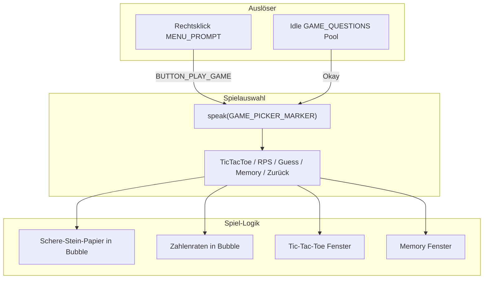

# Kinito Mini-Spiele — Ideen und Umsetzungsplan

## Spielideen nach Schwierigkeit

| Spiel | Aufwand | Warum es passt |
|-------|---------|----------------|
| **Schere-Stein-Papier** | Sehr leicht | Läuft komplett in der Speech-Bubble (3 Buttons), kein Extra-Fenster |
| **Zahlenraten** | Sehr leicht | Textbox + Hinweise („höher/niedriger“), passt zum Dialog-System |
| **Tic-Tac-Toe** | Leicht | 3×3-Button-Grid in einem `Toplevel`, einfache KI (Zufall oder Minimax) |
| **Memory** | Mittel | 4×4-Karten-Grid, Karten umdrehen, Paare finden — gut für tkinter-Buttons |
| Hangman | Mittel | Wortliste + Buchstaben-Buttons; Zeichnung optional (Text reicht) |
| Connect Four | Mittel | 6×7-Grid mit Fall-Logik und Gewinnprüfung |
| Minesweeper | Mittel–hoch | Kaskaden-Logik, Flaggen, Nachbarzählung — deutlich mehr Code als Tic-Tac-Toe |
| Snake | Mittel–hoch | `Canvas` + `root.after()`-Game-Loop, Kollisionen, Score |
| Simon Says | Mittel | Farbsequenz + Timer, Audio optional über pygame |

**Deine Auswahl für v1:** Tic-Tac-Toe, Schere-Stein-Papier, Zahlenraten, Memory.

---

## Architektur (passt zur bestehenden Codebase)



**Bestehendes Muster nutzen:** Wie Kamera ([`kinito/features/camera.py`](kinito/features/camera.py)) und Secret Images ([`kinito/features/programs.py`](kinito/features/programs.py)) — Spiele öffnen ein `Toplevel`-Fenster neben dem Pet, Kinito kommentiert mit `speak_brief()` / `speak()`.

**Wichtig:** Das aktuelle `GAME_QUESTION`-Dialog startet bei „Okay“ nur einen zufälligen Desktop-Shortcut via `play_random_program()`:

```269:272:content/dialog_registry.py
    DialogSpec(
        dlg.GAME_QUESTION,
        DialogUI("buttons", buttons=(dlg.BUTTON_OKAY, dlg.BUTTON_NOT_NOW)),
        _okay_not_now(lambda a: a.play_random_program(), dlg.GAME_DECLINED_LINES),
```

Das wird auf `offer_game_picker()` umgestellt. `play_random_program()` bleibt als interne Hilfsfunktion erhalten (falls später noch gebraucht).

---

## Dateistruktur (neu)

```
kinito/features/games/
  __init__.py          # GamesMixin (Einstieg, Spielauswahl, Fenster-Management)
  base.py              # Gemeinsame Hilfen: Fenster positionieren, schließen, Kinito-Kommentare
  tic_tac_toe.py       # TicTacToeGame-Klasse
  memory.py            # MemoryGame-Klasse
  rock_paper_scissors.py  # RPS-Logik (Bubble-basiert)
  number_guess.py      # Zahlenraten-Logik (Bubble-basiert)

content/game_lines.py  # Kinito-Kommentare: Gewinn, Verlust, Remis, Einladungen
```

Kein neues Framework — alles **tkinter** (`Toplevel`, `Frame`, `Button`, `Label`), konsistent mit dem Rest der App.

---

## Schritt-für-Schritt Umsetzung

### 1. Texte und Dialog-Registry

**[`content/dialogue.py`](content/dialogue.py):**
- `MENU_OPTIONS` um `"Play a Game"` erweitern + Konstante `BUTTON_PLAY_GAME`
- Neuer Spielauswahl-Dialog:
  - `GAME_PICKER_MARKER = "pick a game"` (Marker-Substring, wie bei Browser)
  - `GAME_PICKER_QUESTION = "Pick a game! What do you want to play?"`
  - Button-Labels: `Tic-Tac-Toe`, `Rock Paper Scissors`, `Number Guess`, `Memory`, `Not Now`
- `GAME_QUESTIONS` beibehalten (Kinito fragt weiterhin spontan „How about we play a game!“), Texte ggf. leicht anpassen („ein echtes Spiel mit mir“)

**[`content/dialog_registry.py`](content/dialog_registry.py):**
- `_handle_menu`: `BUTTON_PLAY_GAME` → `lambda a: a.offer_game_picker()`
- `GAME_QUESTION`-Handler: `_okay_not_now(lambda a: a.offer_game_picker(), ...)` statt `play_random_program()`
- Neuer `DialogSpec` für `GAME_PICKER_MARKER` mit `_button_map({...})` → ruft `start_tic_tac_toe()`, `start_rock_paper_scissors()`, etc. auf

**[`content/game_lines.py`](content/game_lines.py)** (neu):
- Zeilen für Einladung, Gewinn, Verlust, Remis, falsche Eingabe — im Stil von [`content/hug_lines.py`](content/hug_lines.py)

### 2. GamesMixin einbinden

**[`kinito/app.py`](kinito/app.py):**
- `GamesMixin` importieren und in `FloatingAssistant`-Vererbungskette einfügen (z. B. nach `ContentMixin`)

**[`kinito/features/games/__init__.py`](kinito/features/games/__init__.py):**
- `offer_game_picker()` — prüft `_is_busy_with_speech()`, dann `speak(GAME_PICKER_QUESTION, 45, True)`
- `_ensure_single_game_window()` — schließt vorheriges Spiel-Fenster, falls offen (nur ein Spiel gleichzeitig)
- `start_*()`-Methoden delegieren an die einzelnen Spiel-Module

### 3. Gemeinsame Fenster-Hilfe (`base.py`)

Wiederverwendbare Logik aus [`programs.py`](kinito/features/programs.py) (`show_image_window`):
- Fenster zentriert neben Pet positionieren (`winfo_vroot*`)
- `protocol("WM_DELETE_WINDOW", on_close)` — beim Schließen kurzer Kinito-Kommentar
- Optional: `root.after(0, ...)` für Thread-Sicherheit (wie bei Kamera)

### 4. Einzelne Spiele

#### Schere-Stein-Papier (einfachster Einstieg)
- Kein Extra-Fenster: nach Auswahl im Picker → neuer `speak()` mit Marker + 3 Buttons
- Kinito wählt zufällig, `speak_brief()` mit Ergebnis
- Best-of-3 optional, aber nicht nötig für v1

#### Zahlenraten
- Kinito denkt Zahl 1–100, neuer Dialog mit Textbox
- Handler zählt Versuche, antwortet „höher“ / „niedriger“ / „richtig!“
- Nach 7–10 Versuchen aufgeben oder Hinweis

#### Tic-Tac-Toe
- `Toplevel` ca. 320×360 px, 3×3 `Button`-Grid
- Spieler = X, Kinito = O
- KI: für v1 **einfache Heuristik** (Mitte/Ecke bevorzugen, blockieren wenn nötig) — kein vollständiges Minimax nötig
- Bei Gewinn/Remis: `speak_brief()` + „Nochmal?“-Buttons im Fenster oder zurück zum Picker

#### Memory
- 4×4-Grid (8 Paare), Karten als Buttons mit `?` / Emoji / Farben
- Zwei Karten aufdecken → bei Treffer bleiben offen, bei Fehlschlag nach 800 ms wieder verdecken
- Zugzähler; Kinito kommentiert bei Meilensteinen (erstes Paar, Hälfte, Gewinn)

### 5. Idle-Verhalten erweitern

**[`kinito/features/content.py`](kinito/features/content.py):**
- `offer_game_picker` in `perform_random_menu_action()`-Liste aufnehmen (selten, ~gleiche Wahrscheinlichkeit wie andere Aktionen)

`GAME_QUESTIONS` bleibt in [`content/questions.py`](content/questions.py) — Kinito fragt weiterhin spontan; „Okay“ führt jetzt zur Spielauswahl statt zum Desktop-Shortcut.

### 6. Tests

Neue Testdateien analog zu [`tests/test_dialog_handlers.py`](tests/test_dialog_handlers.py):
- `tests/test_games.py` — Tic-Tac-Toe-Gewinnlogik, Memory-Paar-Matching, RPS-Ergebnis
- `tests/test_dialog_registry.py` erweitern — `GAME_PICKER_MARKER` in allen Varianten, Menü-Button-Mapping
- `tests/test_dialog_handlers.py` — `BUTTON_PLAY_GAME` ruft `offer_game_picker` auf

Spiel-Fenster-Tests mit gemocktem `tk.Tk()` (wie bestehende Tests in `conftest.py`).

---

## UX-Details

| Aspekt | Verhalten |
|--------|-----------|
| Rechtsklick | Neuer Menüpunkt „Play a Game“ → Spielauswahl-Bubble |
| Spontan | Bestehende `GAME_QUESTIONS` → „Okay“ → Spielauswahl |
| Während Spiel | Kinito spricht kurz (`speak_brief`), unterbricht kein laufendes Spiel |
| Mehrere Spiele | Nur ein Spiel-Fenster gleichzeitig; neues Spiel schließt altes |
| Persönlichkeit | Kommentare in `game_lines.py` — witzig, im Kinito-Ton („I saw that coming.“) |

---

## Geschätzter Aufwand

| Teil | Aufwand |
|------|---------|
| Dialog/Registry/Menü | ~1–2 h |
| RPS + Zahlenraten | ~1–2 h |
| Tic-Tac-Toe | ~2–3 h |
| Memory | ~3–4 h |
| Tests + Feinschliff | ~2 h |
| **Gesamt v1** | **~10–13 h** |

---

## Spätere Erweiterung (v2)

- **Minesweeper** — eigenes Modul `minesweeper.py`, 9×9 oder 10×10, Schwierigkeitsstufen
- **Hangman** — Wortliste in `content/words.py`
- **Highscores** — einfache JSON-Datei neben `timer.txt`
- **Schwierigkeit** — Memory 6×6, Tic-Tac-Toe Minimax

---

## Risiken / Hinweise

- **Menü wird breiter:** `MENU_OPTIONS` hat bereits 10 Einträge; Button-Wrapping in `show_response_buttons()` funktioniert bereits (max. Breite 800 px).
- **Kein Sprachbefehl:** Die App hat kein STT — Spiele nur per Klick/Textbox, nicht per Mikrofon.
- **Modalität:** `wait_window()` wie bei Secret Images blockiert Maus — für Spiele besser **nicht** modal, damit Kinito weiter wandern kann.
