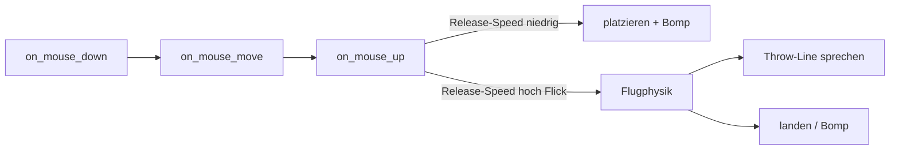

# Kinito werfen – Umsetzungsplan

## Ausgangslage

Drag endet heute abrupt: [`on_mouse_up`](kinito/movement.py) setzt nur `is_dragging = False` und platziert Kinito. Es gibt **keine** Geschwindigkeits-Samples, keine Schwerkraft und kein Abprallen. Position läuft über `self.x`/`self.y` + `root.geometry(...)`.



## Gewählte Defaults

- **Kurve:** ballistisch (`vy` steigt durch Gravity → Parabel)
- **Richtung/Speed:** nur aus den **letzten** Drag-Samples kurz vor dem Loslassen (nicht aus der Peak-Geschwindigkeit der ganzen Drag-Geste)
- **Normales Platzieren:** Schnell ziehen, dann abbremsen/anhalten und loslassen → **kein Flug**, nur Platzieren + Bomp (wie heute)
- **Werfen:** Flick – beim Loslassen noch hohe Geschwindigkeit → Flug
- **Bildschirmrand:** abprallen mit Dämpfung (nicht hart stoppen)
- **Animation:** `root.after`-Ticks auf dem Tk-Thread
- **Sprite:** kein neues Asset; leichtes Standbild / optionaler Tilt während des Flugs
- **SFX:** `Woosh.mp3` beim Wurfstart, `Bomp.mp3` bei Landung bzw. bei normalem Place
- **Reaktion:** zufällige Throw-Lines (fröhlich bis genervt), z. B. „Weeeee!“ / „Don't do that!“
---

## Schritt 1 – State und Konstanten

In [`kinito/movement.py`](kinito/movement.py) und Init in [`kinito/app.py`](kinito/app.py):

- Flag: `self._throwing = False`
- Sample-Buffer: `self._drag_samples = []` (Liste von `(t, x, y)`)
- After-Handle: `self._throw_after_id = None` (zum Abbrechen)
- Konstanten am Mixin, z. B.:
  - `THROW_SAMPLE_WINDOW_MS = 80` (nur frische Samples zählen)
  - `THROW_MIN_SPEED_PX_S = 900` (darunter = normales Platzieren)
  - `THROW_MAX_SPEED_PX_S = 4500` (Cap, damit Extreme nicht durch die Decke schießen)
  - `THROW_VELOCITY_SCALE = 1.0`
  - `THROW_GRAVITY = 2800` (px/s², nach unten)
  - `THROW_AIR_DRAG = 0.15` (leichte Luftreibung)
  - `THROW_BOUNCE_DAMPING = 0.55` (Energieverlust am Rand)
  - `THROW_STOP_SPEED_PX_S = 120` (unterhalb → Landung)
  - `THROW_FRAME_MS = 16` (~60 fps)

---

## Schritt 2 – Geschwindigkeit während des Drags tracken

**`on_mouse_down`:** Buffer leeren; falls noch ein Wurf läuft → `_cancel_throw()` (Greifen unterbricht Flug).

**`on_mouse_move`:** nach dem Setzen von `self.x`/`self.y` Sample anhängen:

```python
self._drag_samples.append((time.monotonic(), new_x, new_y))
# nur Samples der letzten THROW_SAMPLE_WINDOW_MS behalten
```

Drag-Verhalten (1:1 folgen, clamp) bleibt unverändert.

---

## Schritt 3 – Place vs. Throw (kritisch für Feel)

**Regel:** Entscheidend ist nur die Geschwindigkeit **im Moment des Loslassens** (Samples der letzten ~80 ms), nicht wie schnell man zwischendurch gezogen hat.

| Geste | Ergebnis |
|--------|----------|
| Ziehen (auch schnell), dann stoppen/langsamer werden, loslassen | **Place** + Bomp, kein Flug |
| Kurzer Flick / Loslassen bei noch hoher Speed | **Throw** + Woosh + Flug |
| Klick ohne Bewegung | kein Bomp (wie heute) |

Ablauf in `on_mouse_up`:

1. Drag-Flags zurücksetzen, Tracking stoppen.
2. `(vx, vy)` nur aus dem frischen Sample-Fenster berechnen.
3. Speed clampen/skalieren.
4. Branch:
   - `speed < THROW_MIN_SPEED_PX_S` oder kein `_drag_moved` → **Place-Pfad unverändert** (Bomp bei Drag, `ensure_on_screen`)
   - sonst → `_start_throw(vx, vy)` (kein Place-Bomp; Woosh + später Landungs-Bomp)

Damit gilt: „nehmen → schnell ziehen → bewusst platzieren“ bleibt normales Platzieren.

---

## Schritt 4 – Flugschleife (`_start_throw` / `_throw_tick`)

Neue Methoden in [`kinito/movement.py`](kinito/movement.py):

1. `_start_throw(vx, vy)`:
   - `self._throwing = True`, `self.moving = True` (bestehende Guards für Roam/Idle/Mouse-Look greifen größtenteils schon)
   - `self._throw_vx/vy = vx, vy`
   - `self._throw_last_t = time.monotonic()`
   - optional: Speech-Bubble-Offset behalten / weiter folgen
   - `play_sfx(woosh_file_path)` (mit bestehendem `_should_skip_drag_sounds`-Guard)
   - ersten Tick per `schedule_after` / `root.after(THROW_FRAME_MS, self._throw_tick)` planen

2. `_throw_tick()`:
   - Abbruch wenn nicht `_running`, `paused`, oder `is_dragging`
   - `dt = now - last_t` (capped, z. B. max 0.05s)
   - Physik:
     - `vy += THROW_GRAVITY * dt`
     - `vx *= (1 - THROW_AIR_DRAG * dt)` (analog für `vy` leicht)
     - `x += vx * dt`, `y += vy * dt`
   - **Bounce:** gegen `get_screen_bounds()` / `clamp_position`-Grenzen:
     - bei Treffer linker/rechter Rand: `vx = -vx * THROW_BOUNCE_DAMPING`, Position clampen
     - bei oberem/unterem Rand: `vy = -vy * THROW_BOUNCE_DAMPING`, Position clampen
   - Window + Bubble aktualisieren (`geometry`, `_follow_speech_bubble_to_kinito`)
   - Stop-Bedingung: Geschwindigkeit unter Schwelle **und** nahe unterer Kante *oder* sehr kleine Gesamtgeschwindigkeit nach Bounce → `_finish_throw()`
   - sonst nächsten Tick schedulen

3. `_finish_throw()` / `_cancel_throw()`:
   - After canceln, Flags clearen (`_throwing`, `moving`)
   - Position clampen, `ensure_on_screen`
   - bei normaler Landung: Bomp-SFX
   - Bubble-Offsets aufräumen wie bei Drag-Ende

`ensure_on_screen` in [`kinito/app.py`](kinito/app.py) zusätzlich bei `_throwing` überspringen (analog zu `is_dragging`), damit die Physik nicht „weggesnappt“ wird.

---

## Schritt 5 – Reaktionszeilen beim Werfen

Neues Content-Modul analog zu [`content/hug_lines.py`](content/hug_lines.py) / [`content/ads_lines.py`](content/ads_lines.py):

**Datei:** [`content/throw_lines.py`](content/throw_lines.py)

- Pool mit Stimmungsmix (fröhlich → genervt), u. a.:
  - `"Weeeee!"`
  - `"Don't do that!"`
  - weitere kurze Varianten im gleichen Ton (Begeisterung, Überraschung, leichter Protest, verspielte Drohung) – Kinito-Charakter, englisch wie die übrigen Lines
- Helper `pick_throw_line()` via `pick_line` aus [`content/dialogue.py`](content/dialogue.py)

**Wann sprechen:** beim Wurfstart in `_start_throw` (damit „Weeeee!“ während des Flugs hörbar/sichtbar ist), nicht beim Place.

**Guards (wie bei anderen spontanen Lines):**

- nur wenn nicht schon `talking` / busy (`_can_initiate_spontaneous_speech` bzw. `_is_busy_with_speech`)
- Chance z. B. `THROW_REACT_CHANCE = 0.85` (meist reagieren, aber nicht 100 %)
- Aufruf: `self.speak(pick_throw_line())` – Pattern wie Hug/Content-Mixins

Kein LLM-Zwang nötig; reine Script-Lines reichen (optional später `ai_hint` analog Hug).

---

## Schritt 6 – Guards in anderen Features

Überall, wo `is_dragging` autonome Aktionen blockiert, `_throwing` mitprüfen (oder zentraler Helper `_is_user_controlling_position()`):

- [`kinito/movement.py`](kinito/movement.py): `smooth_movement`, `idle_animation`, `_can_look_at_mouse`, `change_sprite`, `move_towards`
- [`kinito/features/ads.py`](kinito/features/ads.py), [`glitch.py`](kinito/features/glitch.py), [`nudges.py`](kinito/features/nudges.py)
- [`kinito/speech.py`](kinito/speech.py): `_kinito_screen_position` / Reposition – tracked `x/y` während `_throwing` bevorzugen (wie bei Drag/Moving)

Empfehlung: ein kleiner Helper im Mixin:

```python
def _is_position_locked_by_user(self) -> bool:
    return self.is_dragging or getattr(self, "_throwing", False)
```

und bestehende `is_dragging`-Guards schrittweise darauf umstellen, wo Position/Interaktion betroffen ist.

---

## Schritt 7 – Feintuning Feel

Nach erstem lauffähigen Stand manuell kalibrieren (Werte nur in den Konstanten):

1. Langsam ziehen + loslassen → Place + Bomp, kein Flug
2. Schnell ziehen, **vor dem Loslassen abbremsen** → Place + Bomp, kein Flug
3. Kurzer Flick beim Loslassen → Throw + Woosh + Line + Kurve
4. Schräg nach oben werfen → Parabel, Bounce, ggf. „Weeeee!“ / genervte Line
5. Sehr starker Wurf → Cap, kein Teleport
6. Während Flug greifen → Cancel, Drag übernimmt
7. Speech-Bubble folgt während Flug

---

## Schritt 8 – Tests

In [`tests/test_movement.py`](tests/test_movement.py) (und ggf. kleinem Test für Lines):

- Samples werden gesammelt / gealtert
- Hohe Peak-Speed während Drag, aber niedrige Release-Speed → **kein** `_start_throw`, **Bomp** wie Place
- Release-Speed über Schwelle → `_start_throw` + Richtung ok
- `_throw_tick` Gravity / Bounce / Finish + Bomp
- `on_mouse_down` während Throw cancelt Flug
- `_start_throw` ruft unter Chance/Guard `speak` mit Throw-Line auf; Place tut das nicht
- `pick_throw_line` liefert Strings aus dem Pool

---

## Reihenfolge der Arbeitspakete

1. State + Konstanten + Helper
2. Sample-Tracking im Drag
3. Release-Velocity: Place+Bomp vs. Throw
4. Physik-Loop + Bounce + Finish
5. `content/throw_lines.py` + Reaktion in `_start_throw`
6. Guards / `ensure_on_screen` / Bubble
7. SFX + Feel-Tuning
8. Unit-Tests

Hauptarbeitsdateien: [`kinito/movement.py`](kinito/movement.py), neu [`content/throw_lines.py`](content/throw_lines.py). Kleine Anpassungen: [`kinito/app.py`](kinito/app.py), Feature-Guards, Tests.