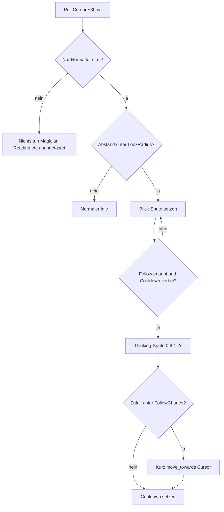

# Maus-Tracking mit „Nachdenken“ und Chance

## Verhalten (festgelegt)

Zwei Schichten:

1. **Nur im normalen Idle: Hinschauen** — Maus innerhalb von ~280 px → Standing-Sprite in die passende Richtung (8 Richtungen, Assets existieren schon).
2. **Manchmal: Folgen** — wenn die Maus länger/näher bleibt, kurz „nachdenken“, dann per Zufall folgen oder bleiben.

## Kein Unterbrechen anderer Modi

Maus-Aufmerksamkeit (Blick **und** Folgen) greift **nur**, wenn Kinito gerade im normalen Standing-/Crouch-Idle ist.

Wenn aktiv (oder busy), bleibt alles wie bisher — **kein** Sprite-Wechsel, **kein** Denken, **kein** Surf:

- Magician / Fancy (`_fancy_mode`)
- Reading (`_reading_idle_active`)
- Hug
- Talking / Speech-Bubble / Chat-Antwort
- **Chat-Modus** (`_chat_mode`) — solange der Chat offen ist, Blicken möglich, aber kein Folgen
- AI-Generating / Thinking (schon belegt)
- Dragging, Roaming (`moving`), Sleep/`paused`
- `_preserve_sprite`

Praktisch: versehentlich nahe Maus während Magician → Magician läuft ungestört weiter. Erst wenn er wieder normal idle ist, darf er zur Maus schauen.

Zentrale Guard-Methode z. B. `_can_react_to_mouse()` → False in allen Busy-States; `_update_mouse_attention` returnt sofort ohne `change_sprite`.

## Anti-Nerv-Regeln

| Regel | Wert (Start) |
|-------|----------------|
| Look-Radius | 280 px |
| Follow-Radius | 180 px (enger als Look) |
| Follow-Chance nach Denken | ~35 % |
| Denkzeit | 0.6–1.2 s (Standing/Standing2-Sprites) |
| Follow-Dauer / Distanz | kurz: max ~120–200 px oder ~1.5 s, dann stoppen |
| Cooldown nach Versuch (egal ob Ja/Nein) | 15–35 s |
| Deadzone Mitte | ~40 px → Front-Sprite (`Standing/Standing2`) |

## Umsetzung

### 1. Richtungs-Mapping aus vorhandenen Sprites

In [`kinito/app.py`](kinito/app.py) / [`kinito/assets.py`](kinito/assets.py): beim Laden der Standing-Sprites aus Dateinamen (`Left`, `Right`, `Top`, `TopLeft`, …) eine Map `direction → PhotoImage` bauen (Standing + Standing2). Fehlende Richtungen fallen auf Front zurück — **keine neuen Assets nötig**; optionale Extra-Sprites später einfach ablegen.

### 2. Cursor-Poll auf dem Tk-Thread

Neue Logik in [`kinito/movement.py`](kinito/movement.py) (passt zu Drag/Idle):

- `root.after(MOUSE_LOOK_POLL_MS, _update_mouse_attention)` starten aus `_start_worker_threads` / Init
- Cursor: `winfo_pointerx/y`
- Buddy-Zentrum: `self.x/y` + Sprite-Größe
- `atan2` → 8 Richtungs-Buckets → `change_sprite`
- Idle-Loop: wenn `_mouse_look_active`, **kein** zufälliges Look-Around überschreiben

### 3. Follow-Entscheidung mit Denken

State-Machine-Flag z. B. `_mouse_follow_state`: `idle | thinking | chasing | cooldown`

- In Look-Zone + Follow-Radius + Cooldown abgelaufen → in `thinking` wechseln, Thinking-Sprites kurz abspielen
- Danach `random.random() < MOUSE_FOLLOW_CHANCE`:
  - **Nein** → Cooldown, zurück zu Look/Idle
  - **Ja** → bestehenden `move_towards()` nutzen (Surf Left/Right), Ziel = Cursor-Position zum Entscheidungszeitpunkt (kein Endlos-Chase hinter bewegter Maus)
- Nach Erreichen/Timeout → Cooldown

Optional: während `thinking` einmalig kurzes SFX weglassen (kein neuer Sound nötig).

### 4. Tests

In [`tests/test_movement.py`](tests/test_movement.py):

- Distanz/Richtung → erwarteter Bucket
- Busy-Guards: Fancy/Reading/Talking → `_can_react_to_mouse()` False, kein `change_sprite`
- Chance/Cooldown: mit gemocktem `random` Follow vs. Ablehnen
- Look aktiv → Idle überschreibt Sprite nicht

## Was du nicht brauchst

Neue Sprites sind **optional**. Für Look reichen die vorhandenen `Standing`/`Standing2`-Richtungen; für Denken/Folgen reichen `Thinking/` und `Surfing/`. Extra-Zwischenwinkel oder „neugierigere“ Looks kannst du später einfach als PNGs mit denselben Namensmustern ablegen.
