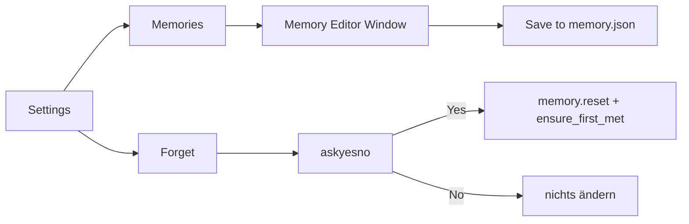

# Memory-Editor und Forget-Bestätigung

## Verhalten



- **Memories** ([`BUTTON_REMEMBER`](content/dialogue.py)): statt `speak(as_spoken_summary)` ein Tk-Fenster öffnen.
- **Forget**: vor dem Löschen `messagebox.askyesno` (wie Paint-Delete in [`kinito/features/paint.py`](kinito/features/paint.py)); bei Abbruch keine Änderung und keine Spoken-Line.

## Speicher-API

In [`kinito/memory/store.py`](kinito/memory/store.py) ergänzen:

- `delete_fact(key) -> bool` — Key aus `facts` entfernen und speichern (fehlt aktuell; nur `remove_fact_value` für Listen-Items).
- Optional helfer `notes_list() -> list[dict]` für die UI (oder direkt aus Snapshot).

`answered_markers` / `asked_topics` bleiben unberührt (nicht im Editor).

## UI (in [`kinito/features/memory.py`](kinito/features/memory.py))

`show_memory_summary` → `open_memory_editor` (Alias/Umbenennen; Handler in [`content/dialog_registry.py`](content/dialog_registry.py) anpassen).

Fenster (Stil nah an Music Player: helles Beige, `apply_window_icon`, topmost):

- Scrollbarer Bereich mit zwei Sektionen: **Facts** und **Notes**
- Fact-Zeile: Key (Label, nicht editierbar) | Value (`Entry`) | Delete
- Note-Zeile: Text (`Entry`) | Delete
- Leerer Zustand: kurzer Hinweistext
- Buttons unten: **Save**, **Close**
- Ein Fenster gleichzeitig; erneut Memories → bestehendes Fenster anheben und neu laden

**Save:** alle sichtbaren Fact-Values via `set_fact` schreiben; entfernte Keys via `delete_fact`; Notes ersetzen (bestehende Liste clearen/`remove_note` + `add_note`, oder eine kleine `replace_notes`-Methode). Danach kurz `speak` mit neuer Bestätigungszeile (z. B. `MEMORY_SAVED_LINE` in [`content/dialogue.py`](content/dialogue.py)).

Multi-Value-Fakten bleiben als kommagetrennter Display-String editierbar (`facts_dict()` / `set_fact` parsen das bereits).

## Forget-Bestätigung

In `forget_memory`:

```python
if not messagebox.askyesno("Forget everything?", "...", parent=self.root):
    return
# bestehendes reset + ensure_first_met + speak
```

Titel/Text als Konstanten in `dialogue.py` (englisch, wie die UI sonst).

## Tests

- `tests/test_memory_editor.py` (neu): Store `delete_fact`; Forget mit gemocktem `askyesno(False)` ändert nichts; `True` ruft reset-Pfad; Editor-Save/Delete über Store-API (ohne volles Tk wo möglich).
- Dialog-Handler bleibt `BUTTON_REMEMBER` → `open_memory_editor` / `show_memory_summary`-Alias.

## Nicht im Scope

- Key-Umbenennen neuer Fakten
- Bearbeiten von `answered_markers` / Cooldowns
- Forget-Button im Editor (bleibt unter Settings)