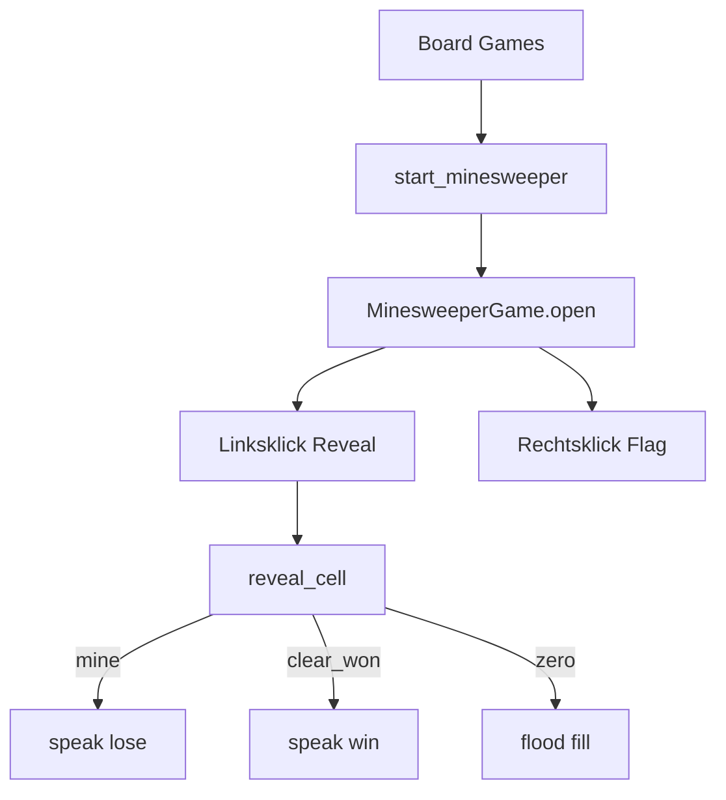

# Minesweeper unter Board Games umsetzen

## Festlegungen

- **Eine Größe:** klassisch **9×9 Felder, 10 Minen** (Anfängerstandard; passt gut in ein Fenster)
- **Menü:** Actions → Play Game → Board Games → Minesweeper
- **Steuerung:** Linksklick = aufdecken; Rechtsklick = Flagge setzen/entfernen
- **Erster Klick sicher:** Minen werden erst nach dem ersten Reveal platziert (oder um den ersten Klick herum neu gewürfelt), damit der Start nicht sofort Game Over ist
- **Kinito:** Kommentar bei Gewinn / Niederlage via `speak_game_line`



## Schritt 1 — Dialog / Lines

[`content/dialogue.py`](content/dialogue.py): `BUTTON_GAME_MINESWEEPER = "Minesweeper"`

[`content/game_lines.py`](content/game_lines.py):

- `MINESWEEPER_WIN_LINES`
- `MINESWEEPER_LOSE_LINES`

## Schritt 2 — Logik ([`kinito/features/games/minesweeper.py`](kinito/features/games/minesweeper.py))

Reine Logik, **ohne tkinter** (wie Battleships):

| Konstante / API | Bedeutung |
|-----------------|-----------|
| `ROWS = COLS = 9`, `MINE_COUNT = 10` | feste Größe |
| `new_game()` | leeres Board; `mines` noch nicht gesetzt; `started=False` |
| `ensure_mines(state, safe_index, rng)` | beim ersten Reveal Minen platzieren, `safe_index` und Nachbarn auslassen |
| `neighbor_count(state, index)` | 0–8 |
| `toggle_flag(state, index)` | Flag umschalten; ignorieren wenn schon revealed / finished |
| `reveal_cell(state, index)` | Mine → lose; sonst aufdecken; bei 0 Flood-Fill; alle Nicht-Minen offen → win |
| `remaining_mines(state)` | `MINE_COUNT - flags` (Anzeige) |

Zellen als flache Indizes `0..80` oder `board[row][col]` — flach wie Battleships ist für Tests oft einfacher. State-Felder u.a.: `mines: set[int]`, `revealed: set[int]`, `flags: set[int]`, `finished`, `won`.

Flood-Fill: iterative Queue über Nachbarn mit `neighbor_count == 0`.

## Schritt 3 — UI ([`kinito/features/games/minesweeper_ui.py`](kinito/features/games/minesweeper_ui.py))

Klasse `MinesweeperGame` analog zu [`battleships_ui.py`](kinito/features/games/battleships_ui.py):

1. `open_game_window` + Status-Label (`Mines left: n` / Ergebnis)
2. `create_uniform_grid(9, 9)` mit Buttons
3. Linksklick → `reveal_cell` → Button-Text aktualisieren (`""` / Zahl / `*` bei Verlust)
4. Rechtsklick (`Button-3`, ggf. `Control-Button-1` für Trackpad) → Flag `F` / entfernen
5. Nach Game Over: restliche Minen zeigen, Buttons sperren, `speak_game_line`
6. **New Game** → State + Buttons reset
7. Zahlen farblich einfach (optional `fg` nach Ziffer); Flagge sichtbar halten

## Schritt 4 — Verdrahtung

[`kinito/features/games/__init__.py`](kinito/features/games/__init__.py):

```python
def start_minesweeper(self):
    self.root.after(0, lambda: MinesweeperGame(self).open())
```

[`content/dialog_registry.py`](content/dialog_registry.py): Button + Handler in Board Games.

README Mini-games-Zeile um Minesweeper ergänzen.

## Schritt 5 — Tests

[`tests/test_games.py`](tests/test_games.py):

- Minenanzahl nach `ensure_mines` == 10; `safe_index` (und Nachbarn) ohne Mine
- Reveal einer 0-Zelle öffnet zusammenhängende Region
- Reveal auf Mine → lose
- Alle Nicht-Minen offen → win
- Flag toggle; Flag auf revealed ignorieren

[`tests/test_dialog_handlers.py`](tests/test_dialog_handlers.py): Board Games → Minesweeper → `start_minesweeper`

## Reihenfolge

1. Logik + Unit-Tests  
2. UI  
3. Dialog / Mixin / Registry  
4. Handler-Tests  

## Abgrenzung

- Keine Schwierigkeitsstufen / Größenwahl
- Kein Chord, kein Timer/Highscore
- Kein Canvas — Button-Grid wie Battleships