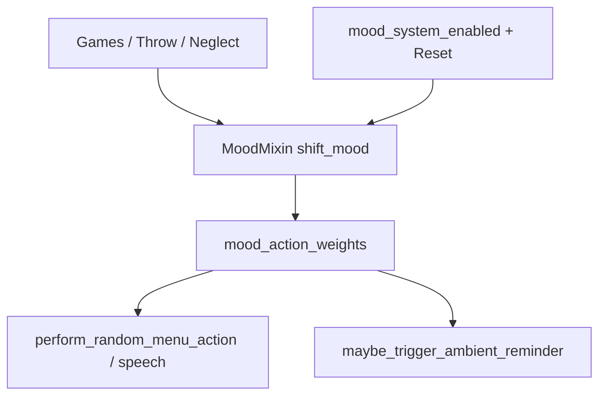

# Mood-Events, Nudges und Settings

## Ausgangslage

[`kinito/features/mood.py`](kinito/features/mood.py) hat bereits `shift_mood` / `soften_mood`, Idle-Gewichte (u.a. `games` ↑ bei bored, ↓ bei annoyed) und Hooks für Hug/Sleep. Fehlend laut Originalplan: Spiele, Throw, Ignoranz, Nudge-Gewichtung.



**Festlegung Settings:** Beides — Boolean-Toggle `mood_system_enabled` (Default `True`) und Reset-Aktion „Reset Mood“ im Settings-Menü.

---

## 1. Zentrale Event-API in MoodMixin

In [`kinito/features/mood.py`](kinito/features/mood.py) neue Methoden (no-ops / early-return wenn Mood aus):

| Methode | Effekt (Richtung) |
|---------|-------------------|
| `on_game_outcome(result)` | `"player_win"` → chance statt `neutral` -> `annoyed`/`sad` (kleiner amount); `"kinito_win"` → `happy` oder soften; `"draw"` → leichter `bored` oder nichts |
| `on_throw()` | Chance Richtung `annoyed`/`angry` (stärker bei wiederholtem Werfen kurz hintereinander) |
| `maybe_neglect_mood()` | Wenn lange keine User-Aufmerksamkeit → `bored`/`sad` |
| `note_user_attention()` | Timestamp `_last_user_attention_at` setzen |
| `reset_mood()` | Hart auf `neutral` / 0.0 + persist |
| `is_mood_system_enabled()` | liest Flag |
| `toggle_mood_system()` | Flag toggeln, persistieren; bei Off → `set_mood(neutral)` und keine weiteren Shifts |

**Ignore-Schwelle:** z.B. `MOOD_NEGLECT_SECONDS = 12 * 60`; in `maybe_drift_mood` (oder direkt aus `smooth_movement` neben Drift) `maybe_neglect_mood` aufrufen. Nicht zählen bei `paused` / Focus / aktivem Spiel / busy speech.

**Attention-Hooks** (jeweils `note_user_attention()`): Drag-Start in [`kinito/movement.py`](kinito/movement.py), Rechtsklick-Menü / Dialog-Response (z.B. Einstieg in `handle_dialog_response`), Chat-Send in [`kinito/features/llm.py`](kinito/features/llm.py) / speech_chat, Spielstart in `GamesMixin`.

**Toggle-Verhalten:** Wenn `mood_system_enabled` False: `shift_mood`/`soften_mood`/`maybe_drift_mood`/`maybe_neglect_mood`/`on_*` returnen sofort; `mood_action_weights()` liefert Baseline (neutral); `mood_tone_hint()` leer oder neutral.

---

## 2. Spiele verdrahten

Eine Hilfsfunktion reicht, Call-Sites bleiben dünn:

```python
# MoodMixin
def on_game_outcome(self, result: str) -> None:
    # result in {"player_win", "kinito_win", "draw"}
```

**Bubble-Spiele** in [`content/dialog_registry.py`](content/dialog_registry.py): nach Win/Lose in `_handle_rps`, Coin/Dice, Number Guess, Trivia-Rundenende (Score ≥ 3 → `player_win`, sonst `kinito_win`).

**Fenster-Spiele:** direkt vor/nach `speak_game_line` bei Endstand:
- [`tic_tac_toe.py`](kinito/features/games/tic_tac_toe.py), [`connect_four.py`](kinito/features/games/connect_four.py) — player / kinito / draw
- [`hangman.py`](kinito/features/games/hangman.py), [`minesweeper_ui.py`](kinito/features/games/minesweeper_ui.py), [`battleships_ui.py`](kinito/features/games/battleships_ui.py), [`memory_ui.py`](kinito/features/games/memory_ui.py) — player win vs lose
- [`snake_ui.py`](kinito/features/games/snake_ui.py) — neuer Highscore ≈ `player_win`, sonst milder `draw`/`kinito_win`

Amounts klein halten (ca. 0.15–0.28), damit nicht jede Partie Mood hart kippt; bestehende `shift_mood`-Semantik nutzen.

---

## 3. Werfen

In [`kinito/movement.py`](kinito/movement.py) `_start_throw` / `_maybe_speak_throw_reaction`: nach Start `on_throw()` aufrufen (wenn vorhanden). Optional kurzer Cooldown-Zähler `_throw_mood_hits`, damit 3 Würfe in Folge eher `angry` als einmaliges Tippen.

---

## 4. Nudges mood-gewichtet

In `_BASE_ACTION_WEIGHTS` / `_MOOD_ACTION_MODIFIERS` neuen Key `nudge_mult` ergänzen, z.B.:
- bored ≈ 1.6–1.8
- happy ≈ 1.15
- annoyed / angry ≈ 0.4–0.55
- tired ≈ 0.7
- sad ≈ 0.9

In [`kinito/features/nudges.py`](kinito/features/nudges.py) `maybe_trigger_ambient_reminder`: effektive Chance = `NUDGE_CHANCE * mood_nudge_mult()`.

**Spiele-Angebote:** Idle-`games`-Gewicht existiert schon (bored ↑ / annoyed ↓). Zusätzlich in [`content/nudge_lines.py`](content/nudge_lines.py) kleine `PLAY_INVITE_NUDGE_LINES`; in `_pick_ambient_nudge_text` bei bored (Intensity ≥ ~0.3) mit z.B. 40 % Chance daraus wählen — so wirken Nudges bei Langeweile explizit als Spiel-Einladungen.

---

## 5. Idle-Snippets erweitern

In [`content/mood_lines.py`](content/mood_lines.py) `IDLE_SNIPPETS_BY_MOOD`: pro Mood von ~2 auf **6–8** Lines (gleicher Ton wie bestehende). Nutzung bleibt in [`kinito/features/llm.py`](kinito/features/llm.py) (Idle-Fallback). Optional kurz `STATUS_BY_MOOD` um 1–2 Varianten ergänzen — kein Muss.

---

## 6. Settings: Toggle + Reset

Muster wie Screen Effects / Reminders:

1. [`kinito/settings_store.py`](kinito/settings_store.py): `mood_system_enabled: True` in `DEFAULT_BOOL_SETTINGS`
2. Load/persist in App wie andere Flags (`_mood_system_enabled`)
3. [`content/dialogue.py`](content/dialogue.py): `BUTTON_MOOD_SYSTEM_ON/OFF`, `BUTTON_RESET_MOOD`, On/Off-/Reset-Linien
4. [`content/dialog_registry.py`](content/dialog_registry.py): in `settings_options_for` + Settings-Handler
5. [`content/menu_visibility.py`](content/menu_visibility.py): Visibility-Einträge für die neuen Buttons
6. `MoodMixin.toggle_mood_system()` / `reset_mood()` + kurze Speak-Bestätigung

Reset spricht eine Line und setzt `neutral`; Toggle Off erklärt, dass Stimmung „aus“ ist.

---

## 7. Tests

Erweitern [`tests/test_mood.py`](tests/test_mood.py) (+ ggf. Dialog/Nudge-Tests):

- `on_game_outcome` / `on_throw` / neglect nach Timeout (mit Fake-Clock / gesetztem Timestamp)
- `nudge_mult` in `blend_action_weights`
- Toggle: Shifts wirkungslos, Weights neutral
- Reset → neutral
- Idle-Snippet-Pools: `len >= 6` pro Mood
- Settings-Key in Store-Defaults

---

## Nicht im Scope

- Neue Mood-IDs oder Sprite-Visuals
- Mood-getönte Game-Win-Lines (Content später)
- Windows-Toasts / Tray
