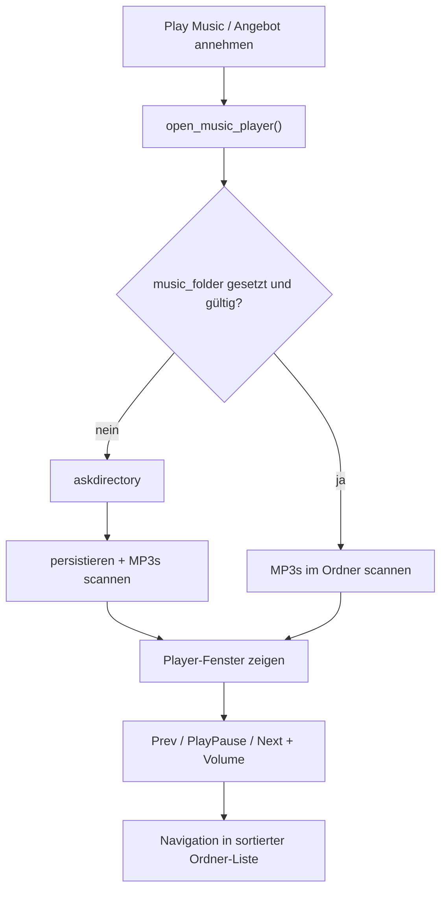

# Kinito's Musik Player

## Verhalten

- **Erster Start:** kein gespeicherter Ordner → Ordnerdialog → Ordner speichern → alle `.mp3` in diesem Ordner (nicht rekursiv in Unterordnern, alphabetisch sortiert) als Playlist.
- **Prev/Next:** Index ±1 in der Playlist (Wrap am Listenende/-anfang).
- **Track-Ende:** automatisch nächster Titel; am Listenende Stopp, Player bleibt offen.
- **Schließen:** Fenster zu, Musik läuft weiter; erneutes „Play Music“ öffnet/hebt den Player wieder.
- **Scope:** nur User-Musik (nicht Poem-/Fancy-Begleitung).

## UI (neues Fenster)

In [`kinito/features/music.py`](kinito/features/music.py) ein topmost-`Toplevel` mit **custom Titlebar** (`overrideredirect(True)`, ziehbar):

- Links: Kinito-Icon (`favicon_path` / `apply_window_icon`-Foto)
- Mitte: Text **„Kinito's Musik Player“**
- Rechts: Schließen-Button (✕)
- Body: **Titel** + **Dauer** (`m:ss`, Länge via `pygame.mixer.Sound(path).get_length()` — kein neues Dependency)
- Controls mit Bootstrap-Icons aus [`GameAssets/musicPlayer/`](GameAssets/musicPlayer/):
  - `skip-backward.svg` | `play.svg` / `pause.svg` (Toggle) | `skip-forward.svg`
- **Lautstärke:** `tk.Scale` 0–100, live `pygame.mixer.music.set_volume`

### Icon-Assets

In [`kinito/assets.py`](kinito/assets.py) Pfade registrieren (`music_player_directory` + die vier Dateien). Tk kann kein SVG: bei der Umsetzung die SVGs einmalig als PNG nebenlegen (oder beim Laden rasterisieren) und als `PhotoImage` auf den Buttons zeigen — **ohne** neues Runtime-Dependency (`cairosvg` o.ä.). Play-Button wechselt das Icon zwischen play/pause je nach `_music_paused` / Busy-State.

Single-Instance: `self._music_player_window`; erneut öffnen → `lift`, UI syncen.

## Playback / State (MusicMixin)

Erweitern/ersetzen in [`kinito/features/music.py`](kinito/features/music.py):

- State: `_music_folder`, `_music_playlist`, `_music_index`, `_music_paused`, `_music_volume`, `_user_music_path/name`
- `open_music_player()` — Einstiegspunkt statt Pick-Dialog
- `choose_music_folder()` — Ordner wählen, speichern, Playlist neu laden (auch aus Settings)
- `play_user_mp3` / Prev / Next / Pause / Unpause — UI aktualisieren
- Poll: Position/Busy weiterführen; bei Ende → Next; Pause nicht als „gestoppt“ werten
- **Entfernen:** `setup_music_control_button`, Label-Helfer, `_open_music_controls` → Manage-Dialog
- Layout in [`kinito/features/programs.py`](kinito/features/programs.py): Music-Button aus `_sync_assistant_controls_layout` streichen
- `setup_music_control_button`-Aufruf in [`kinito/app.py`](kinito/app.py) durch schlanke Musik-State-Init ersetzen

## Persistenz

[`kinito/settings_store.py`](kinito/settings_store.py) erweitern:

- `music_folder` (String, default `""`)
- `music_volume` (Int 0–100, default `75`)

Laden in `FloatingAssistant`, speichern in `_persist_settings`.

## Menü / Dialoge

- [`content/dialog_registry.py`](content/dialog_registry.py): `BUTTON_PLAY_MUSIC` und Yes-auf-Musik-Angebot → `open_music_player()`; Manage-Dialog (`MUSIC_MANAGE_PROMPT` / Stop/Change) entfernen bzw. nicht mehr registrieren
- Spontan-Flow: Angebot → Ja → Player (nicht mehr Pick/Surprise-Blase)
- Optional beibehalten: kurze „Now playing“-Ansage beim Track-Start
- Settings: neuer Button **„Music Folder“** in `settings_options_for` + Handler → `choose_music_folder()` ([`content/dialogue.py`](content/dialogue.py), [`content/menu_visibility.py`](content/menu_visibility.py))

## Tests

[`tests/test_music.py`](tests/test_music.py) und Settings-Tests anpassen:

- Ordnerwahl speichert Pfad / baut Playlist
- Prev/Next Index-Logik
- Play/Pause ruft pause/unpause
- Volume setzt Mixer-Volume
- Kein On-Sprite-Button / Manage-Dialog mehr
- Settings-Load/Save für `music_folder` + `music_volume`
