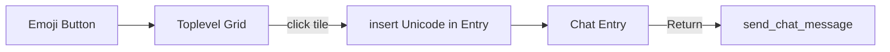

# Pixel-Emoji-Picker (Kuteken, Variante 1)

## Ansatz

- Picker zeigt **Kuteken Pixel Art Emoji** (CC0, ein `emojis.png`-Spritesheet, ~149 Tiles à typisch 16×16).
- Auswahl schreibt das zugehörige **Unicode-Emoji** in `self._chat_entry_widget` (Cursor-Position).
- Chat-Log / TTS bleiben unverändert (System-Darstellung, z. B. Segoe UI Emoji).



## Assets (einzelnes Spritesheet reicht)

Quelle liegt bereits unter [`ai-info/emojis.png`](ai-info/emojis.png) (Kuteken). Beim Implementieren nach [`GameAssets/emojis/emojis.png`](GameAssets/emojis/emojis.png) kopieren + kurze `ATTRIBUTION.txt` (Kuteken, CC0, [itch.io](https://kuteken.itch.io/pixel-art-emoji)).

**Sheet-Analyse (bereits geprüft):**

- Größe **408×304**, Modus **RGBA** (Hintergrund transparent, kein undurchsichtiges Schwarz).
- Label „emoji“ oben links; Face-Grid beginnt etwa bei Offset **(16, 16)**.
- Zellpitch der Smileys/Cats/Hearts ca. **24×24** (15–16 Spalten).
- Inhalt: ~7 Reihen gelbe Faces, Clown/Poop, Alien/Invader/Robot, Cat-Faces, farbige Hearts, danach **Farbpalette + Flags + Kartensymbole** (unregelmäßig — für den Chat-Picker weglassen).

**Catalog** [`GameAssets/emojis/catalog.json`](GameAssets/emojis/catalog.json): Einträge `{ "x", "y", "w", "h", "char" }` (Pixel-Crop + Unicode). Keine fertige Map im Pack — Mapping manuell für Faces/Cats/Hearts/Suits. Palette und Flags nicht aufnehmen.

Pfad-Konstante in [`kinito/assets.py`](kinito/assets.py).

## UI-Integration

Hauptstelle: [`kinito/speech_chat.py`](kinito/speech_chat.py) → `_show_chat_input_row` (zwischen Entry und ×, ca. Zeile 100–109):

```python
# [Entry expand] [emoji] [×]
emoji_button = self._create_bubble_button(
    input_frame, "☺", self._toggle_emoji_picker, width=2, padx=4,
)
emoji_button.pack(side=tk.LEFT, padx=(5, 0))
```

- Styling über `_create_bubble_button` / `ChamferedButton`; Trigger-Label `☺`.
- Neues Modul [`kinito/features/emoji_picker.py`](kinito/features/emoji_picker.py):
  - Sheet mit Pillow laden; pro Catalog-Eintrag `crop((x,y,x+w,y+h))`, auf Anzeigegröße (z. B. 28–32px) mit `Image.NEAREST` skalieren, `ImageTk.PhotoImage` cachen.
  - `Toplevel`-Popup (topmost), Grid der Pixel-Tiles nahe am Button.
  - Klick → `entry.insert(tk.INSERT, char)`, Fokus zurück, Popup zu.
  - Esc / Klick außerhalb / erneuter Button-Klick schließt den Picker.
  - PhotoImage-Refs am Widget halten (GC-Schutz).

## Tests & Docs

- Unit-Tests: Catalog laden, ungültiges Sheet/fehlende Datei graceful, Insert-Callback liefert erwartetes Zeichen (ohne echtes GUI wo möglich).
- Optional leichter Test, dass `_show_chat_input_row` den Emoji-Button vor dem × packt (Mock/Stub wie in [`tests/test_speech_chat.py`](tests/test_speech_chat.py)).
- Kurz in [`README.md`](README.md) Attribution (License-Abschnitt) und ggf. Credits-Dialog erwähnen, falls dort Asset-Listen gepflegt werden.

## Nicht im Scope

- Pixel-Darstellung im Chat-Log (Variante 2).
- Emoji-Button in Dialog-Textboxen außerhalb des Chats.
- SoftBank/Rachel-Singh-Assets.