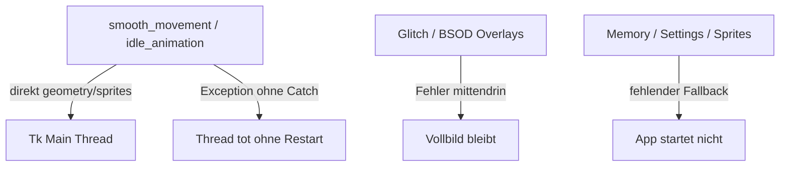

# Robustheits-Ausbau: priorisierte Fundstellen

Audit über Movement, Features, Speech, Memory und Content. Viele Pfade sind schon gut abgesichert (`MemoryStore.load`, SFX-Fallbacks, Ollama-Timeouts, Throw-`TclError`). Die folgenden Stellen lohnen sich am meisten.

---

## P0 — Stabilität / sichtbare Bugs

### 1. Tk-Aufrufe aus Worker-Threads
[`kinito/movement.py`](kinito/movement.py) (`smooth_movement`, `move_towards`, `idle_animation`, `_apply_surf_geometry`) und [`kinito/app.py`](kinito/app.py) (Daemon-Threads) rufen `root.geometry()`, `root.update()`, `panel.config()` / `change_sprite()` direkt aus Hintergrund-Threads auf.

**Ausbau:** Positions-/Sprite-Updates nur noch per `root.after(0, …)` oder Queue auf den Main-Thread; `move_towards` berechnet, Tk rendert. Größtes Absturz-/Hänger-Risiko.

### 2. Worker-Loops ohne Exception-Schutz
`smooth_movement` / `idle_animation` (~1291–1493): eine unbehandelte Exception beendet den Thread dauerhaft — Roaming, Spontanspeech, Idle fallen still aus.

**Ausbau:** `try/except` pro Iteration + Log + kurzer Backoff (wie `_update_mouse_attention`); optional Neustart-Guard.

### 3. BSOD/Glitch ohne Cleanup bei Teilfehler
[`kinito/features/glitch.py`](kinito/features/glitch.py) `_flash_blue_screen` / `_flash_screen_glitch` (~236–306): Blackout/Noise-Fenster werden erzeugt, danach PhotoImage/Label ohne `try/finally`. Bei Fehler bleibt Vollbild-Overlay ohne Hide-Timer.

**Ausbau:** Aufbau in `try/finally`; bei Fehler `hide_blue_screen()` / `hide_screen_glitch()`.

### 4. Startup ohne harten Sprite-Fallback
[`kinito/app.py`](kinito/app.py) `_open_sprite` (73–82): nur Primärpfad abgefangen; `Image.open(fallback_path)` kann den Start crashen.

**Ausbau:** Fallback auch in try/except; letzter Ausweg 1×1-Placeholder + klare Warnung.

### 5. `quotes.json` crasht beim Import
[`content/wisdom.py`](content/wisdom.py) `QUOTES = load_quotes()` (49–61): fehlende/kaputte JSON → App startet nicht.

**Ausbau:** try/except mit leerem Pool + Warnung, oder Lazy-Load beim ersten Zugriff.

---

## P1 — Funktionalität / stiller Feature-Ausfall

### 6. Cooldown vor erfolgreicher Anzeige
[`kinito/features/nudges.py`](kinito/features/nudges.py), [`kinito/features/glitch.py`](kinito/features/glitch.py): `_last_*_at` wird gesetzt, bevor `root.after` das UI zeigt. Bei Abbruch ist das Feature Minuten „tot“, obwohl nichts erschien.

**Ausbau:** Timestamp erst nach erfolgreichem Map/Show setzen.

### 7. Falsches Drag-Attribut nach Fancy-Idle
[`kinito/features/content.py`](kinito/features/content.py) `_restore_sprite_after_fancy` (359): prüft `dragging`, App nutzt `is_dragging` → Sprite kann während Drag zurückgesetzt werden.

**Ausbau:** auf `is_dragging` umstellen (1-Zeilen-Fix).

### 8. TTS-Warte-Schleife ohne Timeout
[`kinito/speech.py`](kinito/speech.py) `_play_tts_wav` (794–801): `while True` bis Stream inaktiv — hängt Stream, bleibt `talking` und blockiert Movement.

**Ausbau:** Max-Wartezeit (Audio-Dauer + Puffer), dann `sd.stop()` + Fehlerpfad.

### 9. Memory: korruptes JSON still verworfen; Save ohne Caller-Schutz
[`kinito/memory/store.py`](kinito/memory/store.py): Parse-Fehler → leerer Store ohne Backup; `save()` kann `OSError` werfen, Memory-Editor meldet trotzdem Erfolg.

**Ausbau:** Corrupt-Backup (`memory.json.corrupt-<ts>`); try/except im Editor mit User-Feedback; Notes-Spiegel-Fehler nicht als Erfolg werten.

### 10. Shutdown: Drag-/Mouse-Timer nicht gecancelt
[`kinito/app.py`](kinito/app.py) `_cancel_periodic_timers`: `_drag_*` / `_mouse_think_timer` fehlen → Callbacks auf zerstörtes Tk.

**Ausbau:** `_clear_drag_sprite_state()` + `_stop_mouse_attention()` beim Destroy aufrufen.

---

## P2 — Härten / Konsistenz

| Stelle | Problem | Fix |
|--------|---------|-----|
| [`kinito/settings_store.py`](kinito/settings_store.py), Scores | schwächere Atomizität als Memory, kein Lock | `_write_text_atomic` + Lock wiederverwenden |
| [`kinito/stt/voice_input.py`](kinito/stt/voice_input.py) | Whisper-Download `timeout=None` | Connect/Read-Timeouts + Fehlermeldung |
| [`content/facts.py`](content/facts.py) | `randfacts.get_fact()` ohne try | except → `KINITO_FACTS` |
| [`content/dialogue.py`](content/dialogue.py) `pick_line` | leere Liste → `IndexError` | Guard / Default-String |
| Surf `_apply_surf_geometry` | kein `TclError`-Guard | analog `_throw_tick` abfangen + Roam stoppen |

---

## Empfohlene Umsetzungsreihenfolge

1. **Schnelle Wins:** `is_dragging`-Fix, Sprite-Fallback, quotes-Load, Cooldown-nach-Erfolg, Glitch `try/finally`, Timer-Cleanup.
2. **Worker-Härte:** Exception-Wrapper in beiden Loops + Surf-`TclError`.
3. **Größerer Refactor:** Tk-Marshaling für Movement/Idle (größter Aufwand, höchster Stabilitätsgewinn).
4. **I/O:** Memory-Corrupt-Backup + Save-Fehlerbehandlung; Settings/Scores atomisch; TTS-Timeout; Whisper-Timeout; randfacts-Fallback.

Kein Scope für diesen Plan: Feature-Neubau oder Content-Erweiterung — rein Robustheit/Fallbacks/Loop-Sicherheit.
