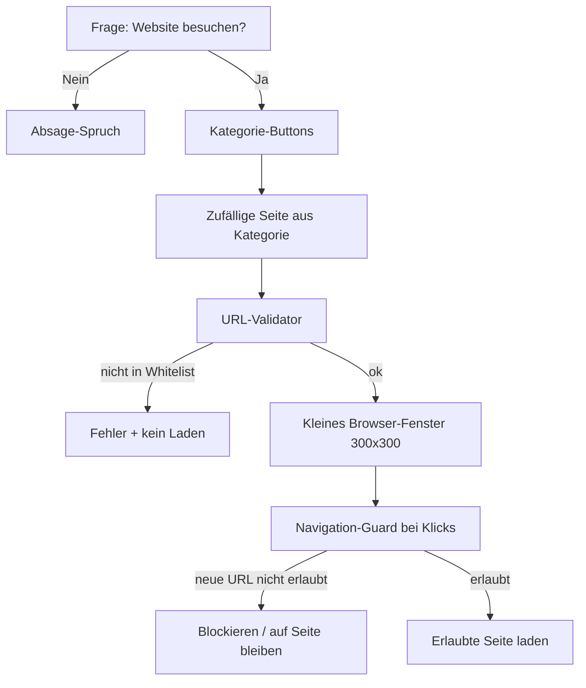

# Browser-Feature für Kinito (Whitelist + Horror)

## Ziel

Kinito soll Webseiten nur nach Nachfrage öffnen können — in einem **kleinen eigenen Fenster** (~300×300 px), **ohne Adressleiste**, mit **Kategorie-Buttons** und **strikter Whitelist**.

Kategorien:

- **Animals / Knowledge / Games** — allgemeine, kuratierte Seiten
- **Horror** — spooky KinitoPET-taugliche Seiten (Spiel-Wikis, Horror-Games, unheimliche Atmosphäre)

## Inhaltsrichtlinie (statt „familienfreundlich“)

Die Whitelist wird manuell geprüft. Erlaubt ist alles, was zum Kinito-Vibe passt. **Explizit ausgeschlossen:**

| Verboten | Beispiele |
|----------|-----------|
| **Gore** | Folter, explizite Gewaltdarstellung, Shock-Gore-Sites |
| **Illegales** | Piraterie, Drogenhandel, Hacking-Tools, Betrug, extremistische Propaganda |
| **Pornografisches Material** | Jegliche pornografischen oder sexuell expliziten Seiten |

Horror ist erlaubt — creepy, unheimlich, Spannung. Aber **kein Gore** und keine Shock-Sites, die primär verstören wollen. Horror Kreaturen, Spiele, Geschcihten usw. sind erlaubt.

Technisch wird das nicht per KI erkannt, sondern über **kuratierte URLs + Navigation-Guard**: Kinito kann nur vorab freigegebene Seiten laden, nicht beliebig im Netz surfen.

## Sicherheitsprinzip

**Niemals frei surfen.** Kinito darf keine URLs von Nutzereingaben, Websuche oder KI erzeugen.



| Schicht | Was sie tut |
|---------|-------------|
| **Whitelist** | Nur fest definierte URLs in [`content/allowed_sites.py`](content/allowed_sites.py) |
| **HTTPS-only** | Kein `http://`, keine IP-Adressen, keine exotischen Schemas |
| **Kein URL-Input** | Kein Textfeld für URLs — nur Buttons |
| **Navigation-Guard** | Klicks auf Links werden geprüft — nur Whitelist-URLs |
| **Nachfrage** | Wie bei der Kamera: erst fragen, dann handeln |
| **Manuelle Kuration** | Jede URL vor Aufnahme prüfen gegen Inhaltsrichtlinie |

## Fenster-Größe und Position

```python
BROWSER_WIDTH = 300
BROWSER_HEIGHT = 300
```

- `resizable=False` — feste Größe
- Position **neben Kinito**, nicht bildschirmfüllend
- Schließen per Fenster-X

## Empfohlene Technik: pywebview

- WebView2 auf Windows, kein Adressleiste
- 300×300, Navigation blockierbar
- Daemon-Thread (analog Kamera)

## Nutzer-Flow

1. *„Want to visit a website with me?“* → **Yes / No**
2. Bei **Yes** → **Animals**, **Knowledge**, **Games**, **Horror**
3. Zufällige Seite aus Kategorie + kurzer Spruch (bei Horror: `HORROR_BROWSER_LINES`)
4. Fenster 300×300 neben Kinito
5. Schließen per X → Abschieds-Spruch

Optional: Rechtsklick-Menü-Eintrag.

## Neue / geänderte Dateien

### 1. [`content/allowed_sites.py`](content/allowed_sites.py) (neu)

```python
ALLOWED_SITES = {
    "animals": [
        {"title": "National Geographic — Animals", "url": "https://..."},
    ],
    "knowledge": [
        {"title": "NASA Space Place", "url": "https://spaceplace.nasa.gov/"},
    ],
    "games": [
        {"title": "itch.io — Horror tag", "url": "https://itch.io/games/tag-horror"},
    ],
    "horror": [
        {"title": "KinitoPET on itch.io", "url": "https://...itch.io/..."},
        {"title": "Creepypasta Wiki", "url": "https://creepypasta.fandom.com/wiki/Creepypasta_Wiki"},
    ],
}
```

- Kommentar pro Eintrag: geprüft gegen Inhaltsrichtlinie (kein Gore/Porno/Illegal)
- Horror: Atmosphäre und Spiele ok; Gore-Shock-Sites nein

### 2. [`content/site_validator.py`](content/site_validator.py) (neu)

- `is_allowed_url(url) -> bool`
- `pick_random_site(category) -> dict`
- Strikter Modus: nur exakte Whitelist-URLs

### 3. [`content/dialogue.py`](content/dialogue.py)

- Browser-Fragen, Kategorie-Buttons, Absage-/Öffnen-/Schließen-Sprüche
- `BROWSER_HORROR_OPEN_LINES` für Horror-Kategorie

### 4. [`content/browser_lines.py`](content/browser_lines.py) (neu)

- `BROWSER_LINES` / `HORROR_BROWSER_LINES`

### 5. [`Kinito.py`](Kinito.py)

- `BROWSER_WIDTH = 300`, `BROWSER_HEIGHT = 300`
- `open_allowed_site(category)`, Navigation-Guard, `_browser_active`

### 6. `requirements.txt`

```
pywebview>=5.0
```

## Was wir bewusst NICHT machen

- Keine freie URL-Eingabe oder Websuche
- Kein LLM-generiertes URL-Picking
- Kein automatisches Content-Scanning im geladenen HTML (nur Whitelist + Link-Block)
- Kein Gore, nichts Illegales, keine Pornografie — auch nicht in der Horror-Kategorie

## Testplan

1. Nachfrage + Kategorien inkl. Horror
2. Fenster ~300×300, nahe Kinito
3. Nur Whitelist-URLs laden
4. Link-Klicks auf nicht-whitelistete URLs blockieren
5. Horror-Sprüche bei Horror-Kategorie
6. Jede URL manuell gegen Inhaltsrichtlinie prüfen
7. Kinito währenddessen verschiebbar

## Bekannte Einschränkung

Whitelist schützt vor **Navigation**, nicht vor Inhalten **innerhalb** einer erlaubten Seite, falls diese verlinkte Unterseiten hat. Deshalb: strikter Navigation-Guard + nur Startseiten/enge URLs aufnehmen, die auch im 300×300-Fenster funktionieren.
