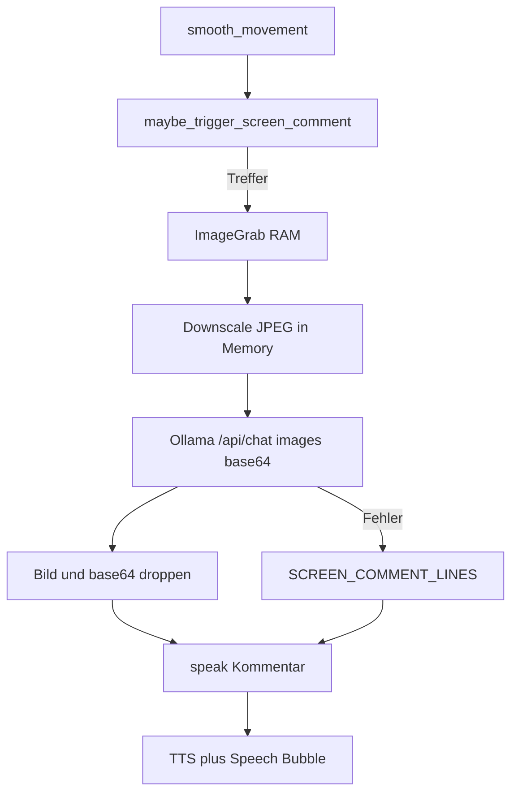

# Screenshot-Kommentare (unsichtbar grabben, sichtbar reden)

## Zielbild

Kinito greift den Screen **ohne sichtbaren Screenshot** (kein Preview-Fenster, kein Blitz, keine Nachfrage). Er **verarbeitet das Bild** kurz lokal und spricht danach ganz normal mit **Speech-Bubble + TTS** — man merkt nur, dass er etwas sagt, nicht dass ein Grab lief.

**Festlegungen (nach Feedback):**

- Speech-Bubble: **ja** (über bestehendes `speak()`)
- Bildanalyse: **ja**, lokal über Ollama Vision
- Speichern: **nie** — weder App noch absichtlich bei Ollama (kein Disk-Write, kein Conversation-History-Eintrag mit Bild)
- Settings: Feature **abschaltbar**

## Privacy-Regeln (hart)

| Darf | Darf nicht |
|------|------------|
| `ImageGrab.grab()` nur lokale Variable | Datei unter `UserMedia/`, Temp, Cache |
| Kurz downscalen (z.B. max. Kante ~768–1024 px, JPEG Qualität mittel) im RAM | Clipboard setzen |
| Einmalig base64 im **localhost**-HTTP-Request an Ollama | Bild in `ConversationHistory` / `memory.json` |
| Nur den **Text**-Kommentar behalten/sprechen | Bild loggen, debug-dump, speichern |
| Settings-Toggle aus | Cloud / externe APIs |

**Ollama „nichts speichern“:** Request enthält `images` nur in diesem einen Call; Antwort ist reiner Text. Die App hängt das Bild **nicht** an Chat-History und schreibt keine Datei. Ollama bekommt die Daten nur transient über `/api/chat` (wie andere Prompts auch) — kein App-seitiges Persistieren, kein erneutes Mitschicken späterer Turns.

## Schritt 1 — Texte / Prompt

[`content/screen_comment_lines.py`](content/screen_comment_lines.py):

- `SCREEN_COMMENT_FALLBACK_LINES` — Fluff, wenn Vision fehlt/fehlschlägt
- Kurz, Kinito-Ton, keine Passwort-/Mail-Behauptungen

[`content/llm_prompts.py`](content/llm_prompts.py):

- `SCREEN_COMMENT_VISION_SYSTEM` / User-Prompt: 1–2 Sätze Kommentar zum Bildinhalt, uncanny-freundlich, **keine** wörtlichen privaten Texte/Passwörter/PINs vorlesen, keine sensiblen Daten zitieren

## Schritt 2 — Ollama Vision (ephemer)

[`kinito/llm/config.py`](kinito/llm/config.py):

- z.B. `vision_model` via Env `OLLAMA_VISION_MODEL` (Default z.B. `llava` oder `llama3.2-vision` — dokumentieren; wenn nicht installiert → Fallback-Lines)

[`kinito/llm/ollama_client.py`](kinito/llm/ollama_client.py):

- Neue Methode z.B. `chat_with_image(prompt, image_bytes, *, system=..., max_tokens=...)`:
  - Payload `/api/chat` mit `"images": [<base64>]` am User-Message
  - `stream: false`
  - **Kein** Speichern der Bytes; Caller verwirft Image danach
- Bestehendes text-only `chat()` unverändert (History bleibt bildfrei)

## Schritt 3 — Mixin

[`kinito/features/screen_comments.py`](kinito/features/screen_comments.py) — `ScreenCommentsMixin`:

- Chance/Cooldownoldown ähnlich Nudges (selten, z.B. `1/300`, ~8–10 Min)
- Guards: `_screen_comments_enabled`, Focus, Game, paused/drag, Camera/Browser, busy speech
- `_do_screen_comment()` auf Main-Thread schedulen, schwere Arbeit in Daemon-Thread:
  1. Grab → downscale → JPEG-bytes im RAM
  2. Vision-Call (wenn Ollama + Vision-Modell erreichbar)
  3. Bytes/`Image` sofort droppen
  4. `self.root.after(0, lambda: self.speak(line))` — **mit Bubble**
  5. Bei Fehler: Fallback-Line sprechen

Kein `self._last_screenshot`. Kein Preview-`Toplevel`.

## Schritt 4 — Idle-Hook + Settings

[`kinito/movement.py`](kinito/movement.py): `maybe_trigger_screen_comment()` bei Ambient-Triggern.

[`kinito/settings_store.py`](kinito/settings_store.py): `screen_comments_enabled: True`

[`kinito/app.py`](kinito/app.py): Mixin einbinden, Flag aus Settings laden.

[`content/dialogue.py`](content/dialogue.py) + [`content/dialog_registry.py`](content/dialog_registry.py): Settings-Eintrag (On/Off-Labels + Toggle-Lines), analog Ambient Reminders / App Awareness.

## Schritt 5 — Tests

- Toggle / Focus / Cooldown verhindern Trigger
- Capture-Pfad: gemockter Grab → Assert kein `.save()`, kein Attribut am App-Objekt
- Vision-Client: Payload enthält `images`, Response-Text wird gesprochen; History ohne Bild
- Ollama down → Fallback-Line

## Abgrenzung

- Kein sichtbares Screenshot-UI, keine Erlaubnisfrage
- Kein Dauer-Monitoring
- Kein Speichern von Screenshots durch die App; keine Bild-Anhänge in Chat/Memory
- Text-LLM-Modell ohne Vision → Fallback, kein Crash

## Reihenfolge

1. Prompt + Fallback-Lines  
2. `OllamaClient.chat_with_image` + Config  
3. `ScreenCommentsMixin`  
4. Movement-Hook + Settings-Toggle  
5. Tests  
