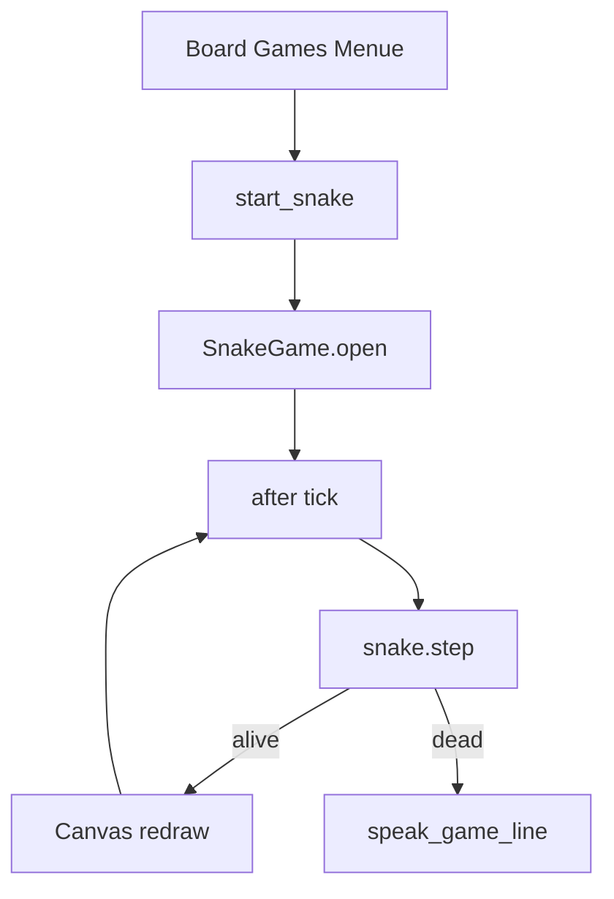

# Snake unter Board Games umsetzen

## Ausgangslage

Spiele folgen keinem Plugin-System, sondern dem bestehenden Dialog-/Mixin-Muster. Board Games öffnen ein `Toplevel` über [`open_game_window()`](kinito/features/games/base.py); der Menüpfad ist bereits:

Rechtsklick → **Actions** → **Play Game** → **Board Games** → Spielwahl

Referenz: Battleships ([`battleships.py`](kinito/features/games/battleships.py) + [`battleships_ui.py`](kinito/features/games/battleships_ui.py)), verdrahtet in [`_handle_board_games`](content/dialog_registry.py) und [`GamesMixin.start_battleships()`](kinito/features/games/__init__.py).

**Festgelegter Spielumfang (Klassisch+):** Grid, Pfeiltasten/WASD, Food, Wachstum, Wand-/Selbstkollision, Score, Geschwindigkeitsanstieg, Session-Highscore, New Game, Kinito-Kommentar bei Game Over.



## Schritt 1 — Dialog-Texte und Buttons

In [`content/dialogue.py`](content/dialogue.py):

- `BUTTON_GAME_SNAKE = "Snake"`
- Kein eigener Marker nötig (Board-Games-Submenü reicht; wie bei Tic-Tac-Toe/Memory/Battleships)

In [`content/game_lines.py`](content/game_lines.py):

- `SNAKE_GAME_OVER_LINES` mit `{score}` / optional `{highscore}`
- Optional `SNAKE_NEW_HIGH_LINES` wenn Session-Highscore gebrochen wird

## Schritt 2 — Reine Spiellogik (`snake.py`)

Neue Datei [`kinito/features/games/snake.py`](kinito/features/games/snake.py) — **ohne tkinter**, testbar wie Battleships:

| Konzept | Vorschlag |
|---------|-----------|
| Grid | z.B. 16×16 Zellen |
| State | `dict` mit `snake` (Liste von `(x,y)`, Kopf zuerst), `direction`, `pending_direction`, `food`, `score`, `alive`, `grew` |
| `new_game()` | Startschlange mittig, Food zufällig, Score 0 |
| `queue_direction(state, dx, dy)` | Richtung merken; 180°-Wende ablehnen |
| `step(state)` | Kopf bewegen, Wand/Selbst → `alive=False`; Food → wachsen + Score++; sonst Schwanz entfernen; neues Food |
| `tick_delay_ms(score)` | Start ~150–180 ms, stufenweise schneller (Untergrenze ~70 ms) |

Food nie auf dem Schlangenkörper spawnen.

## Schritt 3 — Canvas-UI (`snake_ui.py`)

Neue Datei [`kinito/features/games/snake_ui.py`](kinito/features/games/snake_ui.py), Klasse `SnakeGame` analog zu `BattleshipsGame`:

1. `open()` → `open_game_window(app, "Snake with Kinito", …)`
2. Status-Label: Score + Highscore
3. `tk.Canvas` zeichnet Zellen (Kopf, Körper, Food) — einfache Rechtecke, kein Sprite-Zwang
4. Key-Bindings: Pfeiltasten + WASD → `queue_direction`
5. Game-Loop: `window.after(delay, self._tick)`; bei Fenster-Close Loop stoppen (`_running = False`)
6. Game Over: Loop stoppen, Label aktualisieren, `app.speak_game_line(...)` einmal
7. Button **New Game** → State reset, Highscore behalten, Loop neu starten
8. Fokus auf Fenster/`Canvas`, damit Tastatur sofort funktioniert

Session-Highscore als Instanzattribut auf `SnakeGame` (kein Persistenz-File).

## Schritt 4 — Launcher in GamesMixin

In [`kinito/features/games/__init__.py`](kinito/features/games/__init__.py):

```python
def start_snake(self):
    """Open a snake game window."""
    self.root.after(0, lambda: SnakeGame(self).open())
```

Import von `SnakeGame` wie bei den anderen Board Games. `_is_game_active()` greift bereits über `_game_window` — keine Extra-Logik nötig.

## Schritt 5 — Menü verdrahten

In [`content/dialog_registry.py`](content/dialog_registry.py):

1. `BOARD_GAMES_MARKER`-`DialogUI.buttons` um `dlg.BUTTON_GAME_SNAKE` erweitern
2. In `_handle_board_games` Actions-Dict: `dlg.BUTTON_GAME_SNAKE: lambda a: a.start_snake()`

Pfad für den Nutzer danach: **Actions → Play Game → Board Games → Snake**.

## Schritt 6 — Tests

[`tests/test_games.py`](tests/test_games.py):

- Richtungswende 180° blockiert
- Schritt ohne Food verkürzt Schwanz nicht (Länge bleibt)
- Food-Hit erhöht Score und Länge
- Wand- und Selbstkollision setzen `alive=False`
- `tick_delay_ms` sinkt mit Score, bleibt ≥ Minimum

[`tests/test_dialog_handlers.py`](tests/test_dialog_handlers.py):

- `_handle_board_games` mit `BUTTON_GAME_SNAKE` ruft `start_snake` auf

Optional README-Zeile zu Mini-games um Snake ergänzen (nur wenn dort die Liste explizit gepflegt wird).

## Reihenfolge der Umsetzung

1. Logik + Unit-Tests (schnell iterierbar ohne UI)
2. UI + Game-Loop
3. Dialog-Texte / `game_lines` / Registry / Mixin
4. Handler-Tests + manuell: Menüpfad + Tastatur + Restart

## Abgrenzung

- Kein Persistenz-Highscore, kein Sound, keine Touch-Controls
- Kein eigener DialogSpec-Marker (nur Board-Games-Button)
- Keine Änderung an Quick Games oder Idle-`GAME_QUESTION` (Picker bleibt gleich)