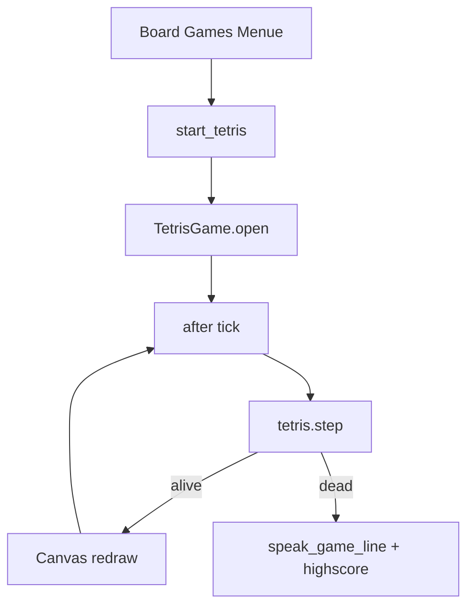

# Tetris unter Board Games umsetzen

## Kurzantwort an dich

**Keine Icons nötig.** Wie bei Snake: farbige Canvas-Rechtecke, gemeinsames Kinito-Fenster-Icon über [`open_game_window()`](kinito/features/games/base.py). Auch kein Sound, keine Sprites, keine externen Libraries.

Sonst brauche ich nichts von dir — Umfang und Steuerung sind unten festgelegt.

## Ausgangslage

Referenz 1:1 wie Snake:

| Schicht | Snake | Tetris (neu) |
|---------|-------|--------------|
| Logik (ohne Tk) | [`snake.py`](kinito/features/games/snake.py) | `tetris.py` |
| UI + Loop | [`snake_ui.py`](kinito/features/games/snake_ui.py) | `tetris_ui.py` |
| Launcher | `GamesMixin.start_snake()` | `start_tetris()` |
| Menü | `BUTTON_GAME_SNAKE` + `_handle_board_games` | analog |
| Scores | `snake_highscore` / `record_snake_score` | `tetris_highscore` / `record_tetris_score` |
| Lines | `SNAKE_*_LINES` | `TETRIS_*_LINES` |

Pfad: **Actions → Play Game → Board Games → Tetris**



## Festgelegter Spielumfang (Klassisch+)

- Spielfeld **10×20** Zellen (Standard-Tetris)
- **7 Tetrominos** I, O, T, S, Z, J, L mit festen Hex-Farben (Guideline-ähnlich)
- **7-Bag**-Zufall (kein reines `choice` — vermeidet lange Dürre)
- Steuerung: Pfeile + WASD; **Rotate** = Up/W; **Soft Drop** = Down/S; **Hard Drop** = Space; Links/Rechts = Left/A / Right/D
- Rotation: clockwise, einfache Wall-Kicks (Position → ±1 X → ggf. ±1 Y); kein volles SRS
- Linien löschen; Score nach einfachen Guideline-Punkten: Single 100, Double 300, Triple 500, Tetris 800, jeweils × Level; Soft-Drop +1/Zelle, Hard-Drop +2/Zelle
- Level = `1 + lines_cleared // 10`; Fallgeschwindigkeit sinkt mit Level (wie Snake `tick_delay_ms`)
- **Next-Piece**-Vorschau (kleines Side-Panel / zweites Canvas)
- Kein Hold, kein Ghost-Piece, kein Sound
- Status: Score, Level, Lines, Highscore; Button **New Game**
- Game Over wenn Spawn blockiert; einmal `speak_game_line` + Mood (`player_win` bei neuem Highscore, sonst `draw`) wie Snake

## Schritt 1 — Dialog-Texte

In [`content/dialogue.py`](content/dialogue.py):

- `BUTTON_GAME_TETRIS = "Tetris"`

In [`content/game_lines.py`](content/game_lines.py):

- `TETRIS_GAME_OVER_LINES` mit `{score}`, `{highscore}`, optional `{level}` / `{lines}`
- `TETRIS_NEW_HIGH_LINES` analog zu Snake

## Schritt 2 — Reine Spiellogik (`tetris.py`)

Neue Datei [`kinito/features/games/tetris.py`](kinito/features/games/tetris.py) — **ohne tkinter**, testbar:

| Konzept | Umsetzung |
|---------|-----------|
| Konstanten | `COLS=10`, `ROWS=20`, Piece-Shapes als Relative-Zellen-Listen pro Rotation 0–3 |
| State-`dict` | `board` (set oder 2D-Liste belegter Zellen + Farbe), `active` (type, rotation, x, y), `next_type`, `bag`, `score`, `lines`, `level`, `alive`, `rng` |
| `new_game(rng)` | leeres Board, volle Bag, Spawn + Next |
| `queue_input` / direkte Actions | `move(dx)`, `rotate()`, `soft_drop()`, `hard_drop()` — mutieren State, return Outcome |
| `step(state)` | Gravity-Tick: 1 Zelle runter oder lock + clear + spawn; bei fehlgeschlagenem Spawn → `alive=False` |
| `tick_delay_ms(level)` | z.B. Start ~500 ms, stufenweise schneller, Floor ~80 ms |
| Hilfen | `_collides`, `_lock_piece`, `_clear_lines`, `_refill_bag`, `_spawn` |

Lock: Zelle für Zelle Farbe speichern, damit `_draw` wie Snake pro Zelle färben kann.

## Schritt 3 — Canvas-UI (`tetris_ui.py`)

Neue Datei [`kinito/features/games/tetris_ui.py`](kinito/features/games/tetris_ui.py), Klasse `TetrisGame` Spiegel von [`SnakeGame`](kinito/features/games/snake_ui.py):

1. `open()` → `open_game_window(app, "Tetris with Kinito", …)` — Breite = Board + Next-Panel
2. Status-Label: Score / Level / Lines / Highscore
3. Haupt-`Canvas`: Board + aktive Figur; Farben aus Piece-Map; tot = grau wie Snake `DEAD_COLOR`
4. Kleines Next-Canvas rechts
5. Key-Bindings → Logik-Actions (auch zwischen Gravity-Ticks sofort anwenden + neuzeichnen — responsiv wie Snake-Richtung)
6. `window.after(tick_delay_ms(level), self._tick)` nur für Gravity; bei Close Loop stoppen
7. Game Over: `_on_game_over` → `record_tetris_score`, `on_game_outcome`, `speak_game_line`
8. **New Game** → Reset, Highscore behalten, Loop neu

Farbschema analog Snake-Dunkelhintergrund (`#1a1a2e` / `#16213e`), Pieces in klassischen Neon-Tönen.

## Schritt 4 — Scores

In [`kinito/features/games/scores.py`](kinito/features/games/scores.py):

- Default-Key `"tetris_highscore": 0`
- `tetris_highscore()` / `record_tetris_score(score) -> bool` (wie Snake, höher = besser)

Tests in [`tests/test_game_scores.py`](tests/test_game_scores.py) spiegeln.

## Schritt 5 — Launcher + Menü

In [`kinito/features/games/__init__.py`](kinito/features/games/__init__.py):

```python
def start_tetris(self):
    """Open a tetris game window."""
    if hasattr(self, "note_user_attention"):
        self.note_user_attention()
    self.root.after(0, lambda: TetrisGame(self).open())
```

In [`content/dialog_registry.py`](content/dialog_registry.py):

- `BUTTON_GAME_TETRIS` in `BOARD_GAMES_MARKER`-Buttons (neben Snake)
- `_handle_board_games`: `dlg.BUTTON_GAME_TETRIS: lambda a: a.start_tetris()`

README bleibt generisch („board games“) — keine Pflichtänderung.

## Schritt 6 — Tests

[`tests/test_games.py`](tests/test_games.py):

- Move/rotate blockiert bei Kollision / Wand
- Soft Drop erhöht Score und y
- Hard Drop locked und spawnt Next
- Volle Zeile wird gelöscht, Score/Lines/Level aktualisiert
- Spawn auf volles Board → `alive=False`
- `tick_delay_ms` sinkt mit Level, ≥ Minimum
- Bag liefert alle 7 Typen bevor Wiederholung

[`tests/test_dialog_handlers.py`](tests/test_dialog_handlers.py):

- Board Games → Tetris → `start_tetris`

## Reihenfolge der Umsetzung

1. Logik + Unit-Tests (ohne UI)
2. Scores-API + Score-Tests
3. UI + Game-Loop
4. Dialog / `game_lines` / Registry / Mixin
5. Handler-Tests + manuell: Menüpfad, Tastatur, Restart, Highscore

## Abgrenzung

- Kein Hold, Ghost, SRS-vollständig, Sound, Online-Leaderboard
- Kein eigener DialogSpec-Marker (nur Board-Games-Button)
- Keine Änderung an Quick Games / Idle-Picker-Struktur
