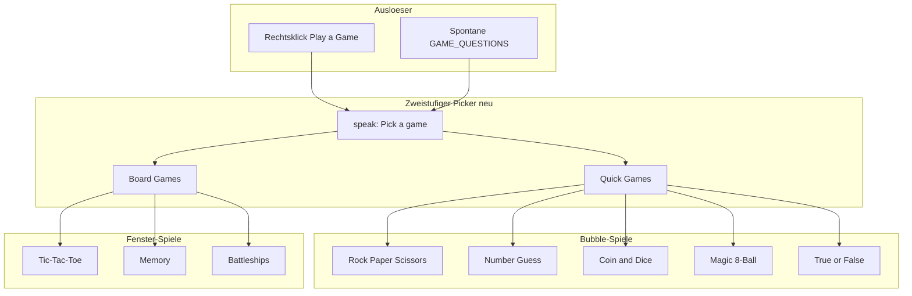

# Vier neue Kinito-Mini-Spiele

## Ausgangslage

Bereits vorhanden ([`kinito/features/games/`](kinito/features/games/)):
- **Bubble-Spiele:** Schere-Stein-Papier, Zahlenraten
- **Fenster-Spiele:** Tic-Tac-Toe, Memory
- Anbindung über [`content/dialog_registry.py`](content/dialog_registry.py), [`GamesMixin`](kinito/features/games/__init__.py), Kommentare in [`content/game_lines.py`](content/game_lines.py)



---

## 1. Zweistufiger Spiel-Picker (Voraussetzung)

Der bestehende flache Picker in [`dialog_registry.py`](content/dialog_registry.py) (Zeilen 386–397) wird umstrukturiert:

| Ebene | Marker | Buttons |
|-------|--------|---------|
| 1 | `GAME_PICKER_MARKER` | `Quick Games`, `Board Games` |
| 2a | `QUICK_GAMES_MARKER` | RPS, Number Guess, **Coin & Dice**, **Magic 8-Ball**, **True or False**, `Back` |
| 2b | `BOARD_GAMES_MARKER` | Tic-Tac-Toe, Memory, **Battleships**, `Back` |

Neue Konstanten in [`content/dialogue.py`](content/dialogue.py):
- `QUICK_GAMES_MARKER`, `QUICK_GAMES_QUESTION`
- `BOARD_GAMES_MARKER`, `BOARD_GAMES_QUESTION`
- `BUTTON_QUICK_GAMES`, `BUTTON_BOARD_GAMES`, `BUTTON_BACK`
- Pro Spiel: Marker, Question, Button-Label (z. B. `BUTTON_GAME_COIN_DICE = "Coin & Dice"`)

Handler in `dialog_registry.py`:
- `_handle_game_picker` → startet Quick- oder Board-Untermenü via `speak()`
- `_handle_quick_games` / `_handle_board_games` → delegieren an bestehende `start_*()`-Methoden; `Back` → `offer_game_picker()`

**Wichtig:** `DIALOG_SPECS`-Reihenfolge beibehalten — spezifischere Marker (`QUICK_GAMES_MARKER`, `BOARD_GAMES_MARKER`) vor dem generischen `GAME_PICKER_MARKER` eintragen, falls nötig.

---

## 1b. New Game / Play Again (einheitliches Restart-Muster)

Bestehende Fenster-Spiele nutzen bereits einen **`New Game`-Button** mit `_reset()`:

- [`tic_tac_toe.py`](kinito/features/games/tic_tac_toe.py): `Button(main, text="New Game", command=self._reset)` — setzt Board, Status und `finished` zurück, Buttons wieder aktiv
- [`memory_ui.py`](kinito/features/games/memory_ui.py): gleiches Muster — Deck neu mischen, Zähler zurücksetzen, Karten verdecken

**Alle neuen Spiele müssen dieses Muster übernehmen** — kein Neustart nur über den Spiel-Picker.

### Fenster-Spiele (Battleships)

Analog zu Tic-Tac-Toe / Memory:
- `Button(main, text="New Game", command=self._reset)` unten im Fenster
- `_reset()` ruft `new_game()` auf, leert Schuss-Anzeige, setzt Status-Label zurück, Zellen wieder klickbar
- Nach Sieg: Board gesperrt, aber **`New Game` bleibt jederzeit klickbar** (wie TTT nach `_end_game`)

### Bubble-Spiele (Coin & Dice, Magic 8-Ball, True or False)

Da es kein Fenster gibt, kommt **Play Again** als Speech-Bubble-Button nach jeder abgeschlossenen Runde:

Neue Konstante in `dialogue.py`: `BUTTON_PLAY_AGAIN = "Play Again"`

| Spiel | Nach Runde | Play Again macht |
|-------|------------|------------------|
| Coin & Dice | Ergebnis gesprochen | Zurück zu `COIN_DICE_QUESTION` (Moduswahl) |
| Magic 8-Ball | Antwort gesprochen | Textbox erneut öffnen (`MAGIC_8_BALL_QUESTION`) |
| True or False | Nach 5. Frage + Score | `start_true_false()` — neue 5er-Runde |

Zusätzlich optional `BUTTON_BACK` → Quick-Games-Untermenü (Nutzer muss nicht X klicken und Menü neu öffnen).

Neuer `DialogSpec` mit `GAME_PLAY_AGAIN_MARKER` (z. B. `"play again"`) und Buttons `(Play Again, Back)` — Ergebnis-Handler sprechen Abschlusszeile **mit Marker im Text**, damit die Buttons erscheinen (gleiches Muster wie Zahlenraten-Reprompt).

---

## 2. Münzwurf / Würfel (Bubble, Quick Game)

**Datei:** [`kinito/features/games/coin_dice.py`](kinito/features/games/coin_dice.py)

| Funktion | Logik |
|----------|-------|
| `flip_coin()` | `random.choice(["heads", "tails"])` |
| `roll_dice()` | `random.randint(1, 6)` |
| `coin_outcome(guess, result)` | `"win"` / `"lose"` |

**Spielablauf (2 Dialog-Stufen):**

1. `COIN_DICE_MARKER` → Buttons: `Flip Coin`, `Roll Dice`
2a. **Münze:** `COIN_FLIP_MARKER` → `Heads` / `Tails` → Kinito flippt, Ergebnis + Kommentar aus `game_lines`
2b. **Würfel:** `DICE_GUESS_MARKER` → Buttons `1`–`6` → Kinito würfelt, Treffer/Verfehlung

`GamesMixin.start_coin_dice()` → `speak(COIN_DICE_QUESTION, 45, True)`

**Kommentare** in [`content/game_lines.py`](content/game_lines.py):
- `COIN_WIN_LINES`, `COIN_LOSE_LINES`
- `DICE_WIN_LINES`, `DICE_LOSE_LINES` (mit `{guess}`, `{roll}`)

**Restart:** Nach Ergebnis Zeile mit `GAME_PLAY_AGAIN_MARKER` sprechen → Buttons `Play Again` / `Back`. `Play Again` → `start_coin_dice()`.

---

## 3. Magic 8-Ball (Bubble, Quick Game)

**Dateien:**
- [`content/magic_8_ball.py`](content/magic_8_ball.py) — ~20 klassische Antworten in Kategorien (yes / no / maybe)
- [`kinito/features/games/magic_8_ball.py`](kinito/features/games/magic_8_ball.py) — `pick_answer() -> str`

**Spielablauf:**
1. `MAGIC_8_BALL_MARKER` + Textbox-Prompt: *"Ask the Magic 8-Ball a yes-or-no question!"*
2. Handler `_handle_magic_8_ball`: leere Eingabe → Invalid-Line + Reprompt; sonst zufällige Antwort formatieren und sprechen
3. Antwort-Zeile enthält `GAME_PLAY_AGAIN_MARKER` → `Play Again` öffnet Textbox erneut, `Back` → Quick Games

Antwort-Format in `game_lines`:
```python
MAGIC_8_BALL_ANSWER_LINES = [
    "You asked: \"{question}\". The ball says: {answer}. Believe it. Or don't.",
    ...
]
```

---

## 4. Wahr oder Falsch (Bubble, Quick Game)

**Datei:** [`content/trivia_questions.py`](content/trivia_questions.py)

Strukturierte Daten (nicht [`facts.py`](content/facts.py) wiederverwenden — dort fehlt ein verifizierbares True/False):

```python
@dataclass(frozen=True)
class TriviaQuestion:
    statement: str
    answer: bool  # True = statement is true

TRIVIA_QUESTIONS: tuple[TriviaQuestion, ...]
```

~25–30 kuratierte Fragen (Mix aus harmlosen Fakten + leichtem Kinito-Humor). `pick_random_question()` ohne Wiederholung innerhalb einer Runde.

**Spielablauf:**
1. `start_true_false()` setzt `app._trivia_score = 0`, `app._trivia_round = 0`, `ROUND_SIZE = 5`
2. `_ask_next_trivia(app)` wählt Frage, speichert `app._trivia_current`, spricht Statement mit `TRUE_FALSE_MARKER`
3. Buttons: `True` / `False` → `_handle_true_false` prüft, zählt Score, kommentiert
4. Nach 5 Fragen: Abschluss mit `{score}` / `{total}` + `GAME_PLAY_AGAIN_MARKER`; `Play Again` startet neue Runde via `start_true_false()`, `Back` → Quick Games

Neue Buttons in `dialogue.py`: `BUTTON_TRUE`, `BUTTON_FALSE`, `BUTTON_PLAY_AGAIN`

---

## 5. Mini-Schiffe versenken (Fenster, Board Game)

**Dateien:**
- [`kinito/features/games/battleships.py`](kinito/features/games/battleships.py) — reine Logik
- [`kinito/features/games/battleships_ui.py`](kinito/features/games/battleships_ui.py) — tkinter-UI

**Regeln v1 (einfach, gut testbar):**

| Parameter | Wert |
|-----------|------|
| Gitter | 5×5 (25 Zellen) |
| Schiffe | 3 Einzelfeld-Schiffe |
| Platzierung | Zufällig, keine Überlappung |
| Spieler | Klickt Zellen zum „Schießen“ |
| Ziel | Alle 3 Schiffe versenken |
| Schusslimit | Keins (oder optional max. 15 — nur wenn zu leicht) |

**Logik-API** (`battleships.py`):

```python
GRID_SIZE = 5
SHIP_COUNT = 3

def new_game() -> dict: ...       # ships: set[int], shots: set[int], hits: set[int]
def place_ships_random(rng) -> set[int]: ...
def shoot(state, index) -> Literal["miss", "hit", "already", "win"]
def all_sunk(state) -> bool
```

**UI** (`battleships_ui.py`):
- `open_game_window()` aus [`base.py`](kinito/features/games/base.py), `create_uniform_grid(5, 5)`
- Zell-States visuell: `~` (Wasser), `X` (Miss), `💥` oder `H` (Hit)
- Status-Label: *"Ships left: N"*
- Bei erstem Treffer / letztem Schiff / Sieg: `app.speak_game_line()` mit Zeilen aus `game_lines`
- **`New Game`-Button** (Pflicht, wie TTT/Memory):
  ```python
  Button(main, text="New Game", command=self._reset).pack(side=tk.BOTTOM, pady=(0, 10))
  ```
- `_reset()`: neuen `new_game()`-State, alle Zellen auf Wasser, Schüsse/Hits zurücksetzen, Eingabe wieder freigeben — auch nach Sieg sofort nutzbar

Fenstergröße: ca. 340×480 px (analog Memory).

---

## 6. Anbindung (gemeinsam für alle 4 Spiele)

### [`kinito/features/games/__init__.py`](kinito/features/games/__init__.py)

Neue Methoden:
- `start_coin_dice()`
- `start_magic_8_ball()`
- `start_true_false()`
- `start_battleships()` → `BattleshipsGame(self).open()`

### [`content/dialog_registry.py`](content/dialog_registry.py)

Neue `DialogSpec`-Einträge (vor generischen Markern):

| Marker | UI | Handler |
|--------|-----|---------|
| `QUICK_GAMES_MARKER` | buttons | `_handle_quick_games` |
| `BOARD_GAMES_MARKER` | buttons | `_handle_board_games` |
| `COIN_DICE_MARKER` | buttons | `_handle_coin_dice_mode` |
| `COIN_FLIP_MARKER` | buttons | `_handle_coin_flip` |
| `DICE_GUESS_MARKER` | buttons 1–6 | `_handle_dice_guess` |
| `MAGIC_8_BALL_MARKER` | textbox | `_handle_magic_8_ball` |
| `TRUE_FALSE_MARKER` | buttons | `_handle_true_false` |
| `GAME_PLAY_AGAIN_MARKER` | buttons | `_handle_play_again` |

`_handle_game_picker` und `_handle_board_games` um die neuen `start_*`-Aufrufe erweitern.

### [`content/game_lines.py`](content/game_lines.py)

Neue Zeilen-Pools für alle vier Spiele + ggf. Picker-Declined-Varianten.

---

## 7. Tests

Erweitern in [`tests/test_games.py`](tests/test_games.py):
- `coin_dice`: Ergebnis in gültigem Bereich, `coin_outcome` korrekt
- `magic_8_ball`: `pick_answer()` liefert bekannte Antwort
- `trivia`: `pick_random_question()`, Score-Logik
- `battleships`: Schiffsplatzierung ohne Duplikate, `shoot` → hit/miss/win, `already`-Schüsse

Erweitern in [`tests/test_dialog_handlers.py`](tests/test_dialog_handlers.py):
- Quick/Board-Picker-Navigation + `Back`
- Coin-Flip-Handler, Dice-Handler, Magic-8-Ball-Textbox, True/False-Runde
- `Play Again` ruft korrektes `start_*()` auf; `Back` öffnet Quick-Games-Menü

Erweitern in [`tests/test_dialog_registry.py`](tests/test_dialog_registry.py):
- Alle neuen Marker matchen ihre Questions
- Picker-Reihenfolge in `DIALOG_SPECS`

---

## 8. Empfohlene Implementierungsreihenfolge

1. **Zweistufiger Picker** — bestehende 4 Spiele umhängen, Tests anpassen
2. **Coin & Dice + Magic 8-Ball** — reine Bubble-Spiele, schnellster Nutzen
3. **True or False** — Content-Datei + 5er-Runden-Logik
4. **Battleships** — Logik + UI, am meisten Code

Geschätzter Umfang: ~12–15 neue/geänderte Dateien, kein neues Dependency.

---

## 9. Bewusste Grenzen (v1)

- Kein Schiffsplatzieren durch den Spieler (nur Kinito platziert verdeckt)
- True/False: feste 5er-Runde pro Durchlauf, keine Highscore-Persistenz über Sessions
- Coin/Dice: keine Best-of-3-Serien (jede Runde einzeln, Neustart via Play Again)
- Bestehende Bubble-Spiele (RPS, Zahlenraten) bleiben unverändert — kein Play Again dort in diesem Scope
- UI-Sprache bleibt Englisch (konsistent mit [`dialogue.py`](content/dialogue.py))
